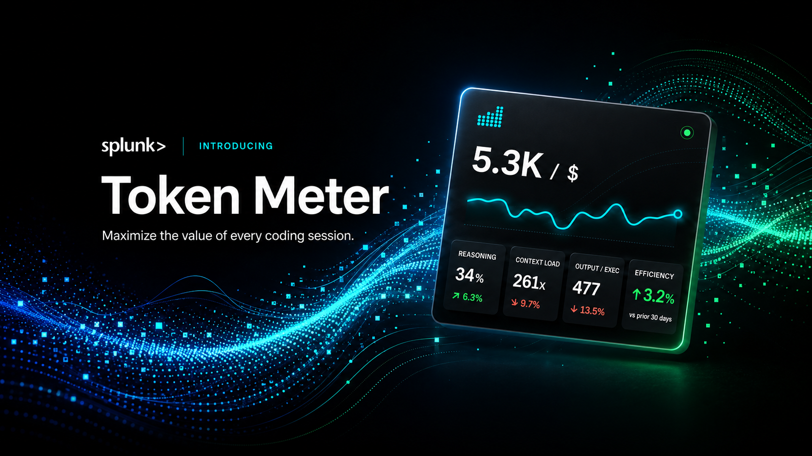
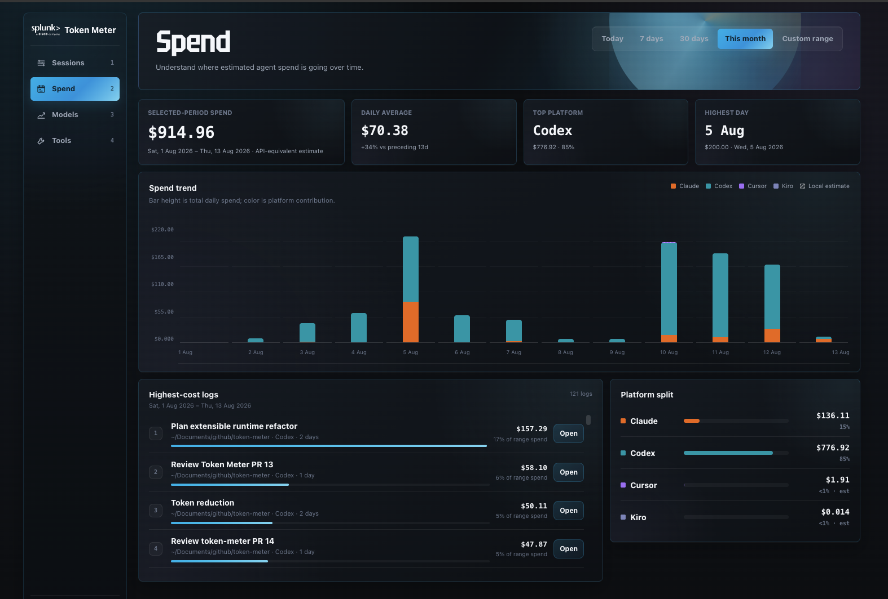

<p align="center">
  
</p>

Token Meter is a local-first observability dashboard for AI coding agents. It
turns session evidence from Claude, Codex, Cursor, OpenCode, and Kiro into one
view of what happened, what it cost, and where time went—so you can decide
whether to continue, intervene, compare, or investigate a run.

Python standard library only. No API keys for trace analysis. No Token Meter
analytics or telemetry leaves your machine.

## Quick Start

### macOS or Linux

```bash
git clone https://github.com/splunk/token-meter.git
./token-meter/scripts/install
```

The installer stages a stable per-user runtime, starts the local server and
native companion, and configures automatic startup.

### Windows

> **Beta:** The Windows extension is still in beta.

```powershell
powershell.exe -NoLogo -NoProfile -ExecutionPolicy Bypass -Command '$p=Join-Path $env:TEMP "token-meter-bootstrap.ps1"; try { Invoke-WebRequest -UseBasicParsing "https://raw.githubusercontent.com/splunk/token-meter/main/scripts/bootstrap-windows.ps1" -OutFile $p; & $p } finally { Remove-Item -LiteralPath $p -Force -ErrorAction SilentlyContinue }'
```

The bootstrap uses WinGet from Microsoft App Installer to install missing Git and Python.
It then stages the beta extension without administrator access. From an
existing checkout, rerun `.\scripts\install-windows.cmd`.

### Open Token Meter

Open [http://127.0.0.1:8722](http://127.0.0.1:8722), start a normal agent run,
and choose it from **Sessions**.

For requirements, development startup, updates, uninstall commands, and
troubleshooting, see the [User guide](specs/USER_GUIDE.md).

**Windows beta uninstall:**
`powershell.exe -NoLogo -NoProfile -ExecutionPolicy Bypass -File "$env:LOCALAPPDATA\Token Meter\runtime\scripts\uninstall-windows.ps1"`

## What You Can Do

| Goal | Token Meter helps you |
| --- | --- |
| **Understand a live run** | Follow estimated cost, tokens, context pressure, wait, output pace, tool calls, execution evidence, and session-budget alerts. |
| **Review history and spend** | Find expensive or slow work across sessions, projects, runtimes, platforms, and calendar ranges. |
| **Compare models and execution** | Compare input, output, pace, wait, and workload shape without presenting weak matches as meaningful results. |
| **Investigate tools and skills** | Find high-output, failing, repeated, unobserved, or deferred capabilities while keeping incomplete evidence explicit. |
| **Manage usage** | Check provider-reported limits, allocate a monthly budget, receive threshold notifications, and let Codex or Claude query bounded evidence through the local MCP. |

## Coverage

**Runtimes:** Claude Code and Desktop Agent/Cowork, Codex CLI and desktop,
Cursor Agent/Composer, OpenCode, and Kiro.

| Platform | Status | Experience |
| --- | --- | --- |
| **macOS** | Supported | Browser dashboard and native menu-bar companion |
| **Linux** | Supported | Browser dashboard and AppIndicator tray companion |
| **Windows** | **Beta** | Browser dashboard and notification-area extension |

Evidence varies by runtime and client version. Missing values remain
unavailable instead of appearing as a misleading zero.

## First Five Minutes

1. Open **Sessions → Current sessions** and select an active run.
2. Check cost confidence, context pressure, wait, input, output, and output pace
   under **Run**. Add a session budget if the run needs an attention limit.
3. After more sessions accumulate, use **Spend**, **Models**, and **Tools** to
   review longer-term patterns.

## Product Tour

### Follow a session

Run, Activity, Tools, Insights, and Alerts keep usage, execution, and budget
evidence connected to the session that produced it.

<p align="center">
  
</p>

### Understand spend

Compare Today, 7-day, 30-day, This month, or a custom period across platforms,
projects, runtimes, and sessions. Spend concentration, percentile session
shapes, and a clickable cost-or-input versus active-time map expose which runs
deserve inspection.

<p align="center">
  
</p>

### Inspect tools and skills

Review observed calls, output estimates, failures, repeats, catalog exposure,
skill-pack activation, and bounded review candidates.

<p align="center">
  
</p>

### Configure budgets and agent access

Manage monthly budgets, model pricing, language signals, native preferences,
and local read-only connections for Codex and Claude. Software update checks
and automatic installation are separate settings; both are on by default.

<p align="center">
  
</p>

### Check without opening the dashboard

Use the macOS menu bar, Linux tray, or beta Windows extension to reach the
current or pinned run. The native clients read a compact local payload and do
not parse traces or read provider credentials directly. Token Meter checks for
updates every 10 minutes and installs safe `main` updates automatically by
default, so normal updates do not require opening the dashboard. If automatic
installation is off, the native menu shows **New update available** instead.

<p align="center">
  
</p>

## Evidence and Privacy

Token Meter reads local runtime stores and binds its dashboard to `127.0.0.1`.
It does not upload traces, prompts, responses, project paths, token counts,
costs, or derived analytics. Do not expose the localhost dashboard publicly.

Costs and selected token values can be estimates. Codex cost uses public
API-equivalent rates, which can differ from subscription billing; Cursor usage
includes local proxies where authoritative values are unavailable. Provider
limit checks make bounded read-only requests using the matching provider's
existing sign-in.

The optional MCP returns bounded derived evidence, not prompts, responses,
reasoning, tool contents, credentials, settings, or trace paths. A result sent
to an explicitly connected agent may be processed by that client's model
provider under its own terms. See the [User guide](specs/USER_GUIDE.md) for the
full evidence semantics and [Security policy](specs/SECURITY.md) for the
canonical boundary.

## Documentation

| Document | Use it for |
| --- | --- |
| [User guide](specs/USER_GUIDE.md) | Requirements, daily use, MCP, updates, uninstall, evidence semantics, and troubleshooting |
| [Security](specs/SECURITY.md) | Privacy and security boundaries or vulnerability reporting |
| [Architecture](specs/ARCHITECTURE.md) | Components, data flow, runtime adapters, and extension contracts |
| [Contributing](specs/CONTRIBUTING.md) | Issues, pull requests, development, and validation |
| [Product principles](specs/PRODUCT.md) and [visual design](specs/DESIGN.md) | Product and experience decisions |
| [Specifications and plans](specs/) | Maintained feature designs and implementation plans |

## License

MIT. See [LICENSE](LICENSE).
