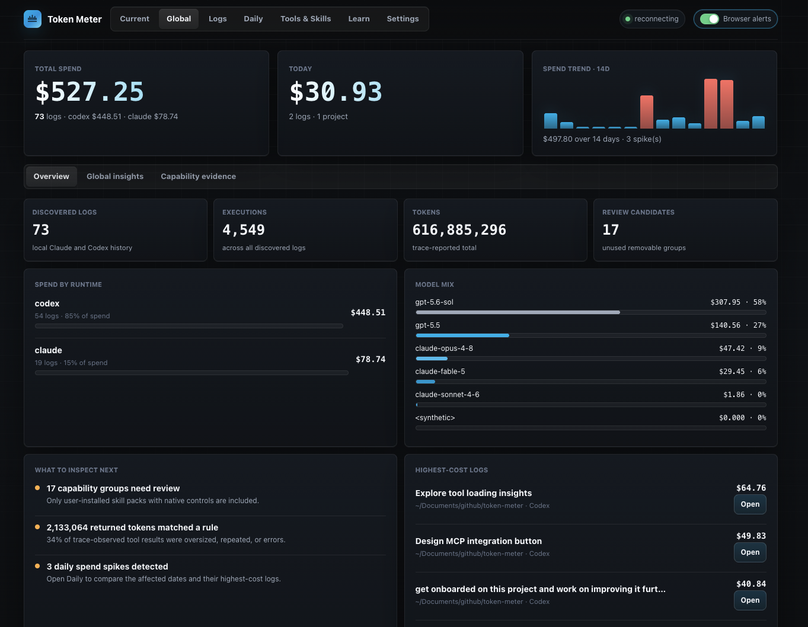

# Token Meter

Claude and Codex make it easy to start an agent session. They make it much
harder to understand what happened during the run, what it cost, and whether
your usage is changing over time. Token Meter reads their local traces and
turns them into one live dashboard.

It helps answer questions such as:

- How is the context window growing during this session?
- How much have I spent on this session?
- How much have I spent on this project in the last week?
- Is token output getting faster or slower over time, and how does that compare
  across models?
- How long am I waiting from prompt to completed response, and which models or
  days make that wait worse?
- Which loaded tools or skills am I not using, and which user-installed skill
  packs should I review for disabling?
- What do the cost, token, execution, and speed numbers look like for each
  model?
- What did I spend and work on each day?
- Can I search or filter old logs by title, project, model, provider, or time,
  then sort them by cost or tokens?
- Which chats show signs of frustration? Token Meter can count configurable
  terms such as `fuck`, `fck`, `shit`, `idiot`, and `bullshit` in human user
  messages. This is a simple lexical signal, not sentiment analysis.
- Can I ask Token Meter these questions directly from Claude or Codex through a
  local, read-only MCP server?
- When several sessions are running, can I pin one and follow it without Token
  Meter switching to another run?

Token Meter supports Claude Code, Claude Desktop Agent/Cowork, Codex CLI, and
the Codex desktop app. It follows local agent logs as they are written and
combines live runs with cross-app history, so the answer is available while you
are working and after the session ends. Costs are estimates based on the model
rates configured in Token Meter.

Local-only. Python standard library only. No API keys. No telemetry leaves your
machine.

## Quick Start

### Download And Install On macOS

For most users, open the repository's [`dist/`](dist/) folder, download the
latest `TokenMeter-*.pkg`, then double-click the downloaded package and follow
the installer. It may ask for an administrator password. The package is currently 
unsigned, so macOS may show a security warning. To update, download and double-click 
the newer package the same way.

Token Meter starts its local server and menu bar widget automatically. Open the
dashboard at:

```text
http://localhost:8722
```

Start a Claude or Codex run and Token Meter will follow its local log. 

### Run From Source

Use this path for development, local changes, or non-package installs:

```bash
git clone https://github.com/Galileo-Agent-Labs/token-meter.git
cd token-meter
./scripts/start-token-meter
```

The menu bar item starts automatically. Open the dashboard at:

```text
http://localhost:8722
```

For source installs that should start automatically, see [Launch At Login](#launch-at-login).

## Visual Tour

### 1. Follow The Current Run

Start on **Current** while an agent is working. The top cards show estimated
cost, prompt-to-response wait time, input/output/thinking tokens, tool-result
volume, and cache behavior. Use
**Execution Overview** and the chart below it to spot context growth, expensive
executions, long waits, or unusually large tool results before deciding whether
to continue.

<p align="center">
  
</p>

### 2. See All Apps In One View

Open **Global** to combine local Claude and Codex history in one place. Compare
token consumption, estimated spend, and cumulative wait time by runtime and
model, see the 14-day
trend, and jump directly to the highest-cost logs or review candidates. This is
the cross-app view for answering what you used, where you used it, and what
deserves attention next.

<p align="center">
  
</p>

### 3. Find Expensive Or Noisy Logs

Open **Logs** to search by title, project, model, or provider. Project and time
filters recalculate the cost, token, execution, wait-time, and model summaries
above the list. Sort by cost, tokens, or wait time to find the runs worth
reviewing first; opening a
row preserves that run as a frozen view, while Delete moves only its JSONL log
to macOS Trash after confirmation.

<p align="center">
  
</p>

### 4. Explain A Day's Spend

Open **Daily** to inspect a recorded local day. The brief compares spend with
the previous day and recent pace, identifies the largest cost driver, and breaks
the day down by project, runtime, highest-cost logs, and completed request wait.
Switch the trend between Spend and Wait, then select any day to see what changed.

<p align="center">
  
</p>

### 5. Inspect Tools, MCPs, And Skills

Open **Tools** to see the capabilities found across scanned Claude and
Codex logs. Compare observed use, returned tokens, last-use evidence, and eager
versus deferred catalog definitions. The view keeps MCP servers read-only and
limits review and disable actions to eligible user-installed skill packs.

<p align="center">
  
</p>

### 6. Ask Token Meter From Codex Or Claude

Open **Settings** to connect the local, read-only `tokenmeter` MCP server to
Codex, Claude Code, or both. Token Meter previews the exact command and manages
only its own user-level entry. Connected agents can check the current run,
review aggregate usage, or inspect user-installed skill-pack hygiene; prompts,
reasoning, tool contents, credentials, and configuration values are never
returned. The same view holds the machine-wide frustration lexicon; edits are
recalculated across every discovered session. Start a new agent session after
connecting.

<p align="center">
  
</p>

### 7. Keep The Live Signal In The Menu Bar

The macOS companion shows the current run, estimated cost, token and execution
count, cache reuse, context pressure, observed output speed, active model, and
last-execution cost. The visible status-bar title starts with cost and keeps
context use, tok/s, and model together. Its shortcuts open the
Dashboard, Daily Brief, Trace, or Tools directly. When several Claude
or Codex runs are active, select a recent session to pin it or choose **Follow
Latest** to resume automatic switching.

<p align="center">
  
</p>

### A Good First Five Minutes

1. Install or start Token Meter, then begin a Claude or Codex task.
2. Confirm **Current** follows the run and check cost plus context pressure.
3. Set a session budget or enable notifications under **Current → Alerts**.
4. Connect Codex or Claude Code from **Settings** if you want on-demand answers
   inside the agent.
5. After a few runs, use **Global** and **Daily** to compare apps and explain
   spend, then open **Logs** or **Tools** for the underlying evidence.

## Features

- **Unified cross-app view**: combines supported Claude and Codex CLI and
  desktop-agent logs into one local view of tokens, estimated spend, models,
  runtimes, projects, and trends.
- **Keyboard navigation**: opens a searchable command palette with Command/Ctrl+K,
  arrow-key selection, and direct Option/Alt+1–9 shortcuts for the primary
  workflow.
- **Live log cost**: shows the running log/thread cost as entries are written,
  with a hover breakdown for uncached input, cached input, cache writes, and
  output tokens.
- **Token split**: separates input, output, thinking, and tool-result tokens so
  you can tell whether cost is coming from model output, cached context, or
  tool payloads.
- **Observed output speed**: shows weighted output tokens per second on Current
  and completed Logs. It prefers tool-free work with reported timing, falls
  back to labeled end-to-end timing when tools are involved, and never turns
  missing timing into a zero-speed claim. It includes trace-reported reasoning
  and thinking output, while excluding input, cache, and external tool results.
- **Wait time**: measures wall-clock time from a user prompt until the completed
  response. It includes reasoning and tool use because the user is still
  waiting. Current shows per-request history, Logs and Global show cumulative
  wait, and Models plus Daily provide average-wait comparisons and trends.
- **Models view**: aggregates model input, output, cost, executions,
  output per execution, timing coverage, output speed, and average wait across
  7-, 30-, and 90-day or all-history windows. The daily chart switches between
  speed and wait while retaining output volume for context.
- **Frustration signals**: counts user turns containing configurable whole
  terms, reports matched utterances and their share of human user turns, and
  compares sessions and models across daily, weekly, 7-, 30-, 90-day, or
  all-history windows. It is explicitly a lexical signal rather than sentiment
  analysis; aggregate counts are retained, not message text.
- **Auto-following**: tracks the newest Claude Code CLI, Claude Desktop
  Agent/Cowork, Codex CLI, or Codex desktop app log across local projects
  without requiring a command per run.
- **Execution trace**: normalizes messages, reasoning, tool calls, tool results,
  usage events, coordination events, and completion events into one timeline.
- **Tool and MCP usage**: groups tools by namespace, call count, returned-token
  volume, and execution so large tool outputs are easy to spot.
- **Efficiency signals**: highlights reasoning share, tool/retrieval bloat,
  coordination tax, cost per task, context pressure, and spend anomalies.
- **Global view**: summarizes local spend and cumulative completed-request wait
  across logs, model mix, provider mix, trend, anomalies, review priorities,
  expensive logs, and trace-backed tool waste across sessions.
- **Logs view**: provides a dedicated searchable and sortable list of every
  discovered Claude and Codex log, with Projects folder and time-range filters
  plus filter-responsive cost, input/output, execution, wait, and model
  statistics and durable links to frozen run views. Confirmed session deletion
  moves only the underlying JSONL log to macOS Trash.
- **Daily summary**: attributes spend and completed-request wait to recorded
  local days, with active logs, projects, runtime mix, highest-cost logs, and a
  Spend/Wait trend switch.
- **Learn view**: provides a practical Token Meter review workflow with direct
  links to each view and a searchable glossary of dashboard terms.
- **Ask from Codex or Claude**: connects a local, read-only MCP server so an
  agent can answer whether to continue, explain aggregate usage change, or
  review optional capabilities with bounded evidence and a dashboard link.
- **Global tool-waste evidence**: ranks tools and MCP namespaces by returned
  tokens, flags oversized results, exact immediate repeats, and structured
  errors, and shows a 14-day result-token trend.
- **Tools view**: inventories trace-observed tools, discovered MCP
  servers, and installed Codex/Claude skills with runtime, source, state, use,
  returned tokens, and last-use evidence.
- **Actionable capability optimization**: measures configured user-installed
  skill packs, groups child skills under their real native control, and excludes
  MCP servers, default tools, and other read-only capabilities from removal
  recommendations.
- **Capability controls**: plugin-managed skill rows can enable or disable their
  containing skill pack through native Codex or Claude settings. A confirmed
  bulk action can disable the exact current unused review candidates while
  rejecting built-in, runtime, used, or stale controls. MCP servers remain
  read-only evidence. Changes apply to future sessions after the IDE or agent
  restarts.
- **Alerts and notifications**: can notify on budget crossings, execution cost
  spikes, and notable log insights.
- **macOS menu bar companion**: shows a compact live status item backed by the
  same local dashboard endpoint, with actions to open the full dashboard and a
  five-session chooser that can pin one Claude or Codex run instead of flipping
  between concurrently active traces. Its Output speed row uses the same
  trace-backed tok/s, timing basis, sample count, and coverage semantics as Current.
- **Local-only operation**: reads local JSONL logs and local capability
  configuration and sends no telemetry. Configuration changes happen only from
  an explicit dashboard action.

## Requirements

- Python 3.8 or newer. The macOS package first tries `/usr/bin/python3`, then
  Homebrew and user `python3` installs.
- Claude Code CLI, Codex CLI, Claude Desktop Agent/Cowork, and/or the Codex
  desktop app if you want live log data.
- macOS with the Swift toolchain, usually from Xcode Command Line Tools, when
  running from source. The macOS package includes a prebuilt menu bar binary.
- `curl`, used by the helper scripts.

The web dashboard has no third-party Python packages. `meter.py` uses only the
Python standard library. Dashboard-only mode is available for development,
troubleshooting, and non-macOS use, but the normal experience includes the menu
bar companion.

## Ask From Codex Or Claude

Open **Settings** and use the **Agent connections** panel to connect Codex,
Claude Code, or both. Token Meter shows the exact local command before it
changes configuration and manages only the user-level MCP entry named
`tokenmeter`. Start a new agent session after connecting.

The three client-visible tools are deliberately compact for crowded MCP lists:

- `mcp__tokenmeter__check` answers questions about the matched current run,
  including “Should I keep this run going?” and an optional execution drill-down.
- `mcp__tokenmeter__usage` reviews aggregate spend, models, tools, or change for
  today, 7 days, or 14 days.
- `mcp__tokenmeter__capabilities` reviews named user-installed skill packs
  without changing them.

The integration is read-only and on demand. Current-run detail is limited to
the caller's matched runtime and project. History is aggregate-only and omits
run titles, project names, session IDs, and paths. Prompts, messages, reasoning,
tool arguments, tool results, credentials, environment variables, and config
values are never returned.

Implicit current-run checks use the runtime's trace-recorded working directory
and refuse stale matches older than six hours. Older logs remain available only
through an explicit log selection or session link, so an abandoned run is not
described as the caller's latest execution.

When a tool is called, its derived result enters the connected agent's context
and may be processed by that client's model provider under the client's own
terms. Token Meter itself makes no outbound network request.

For source installs, the equivalent manual commands are:

```bash
codex mcp add --env TOKEN_METER_CALLER=codex tokenmeter -- "$PWD/scripts/run-token-meter-mcp"
claude mcp add --transport stdio --scope user tokenmeter --env TOKEN_METER_CALLER=claude -- "$PWD/scripts/run-token-meter-mcp"
```

Remove the connections with:

```bash
codex mcp remove tokenmeter
claude mcp remove tokenmeter --scope user
```

Connecting does not create background monitoring or interruptions. The tools
run only when the user or agent calls them; Token Meter's browser and menu-bar
alerts remain the proactive channels.

## Build The macOS Installer Package

Maintainers can build a local installer package:

```bash
./packaging/build-pkg
```

The package is written to `dist/TokenMeter-0.1.0.pkg` by default. For the
repeatable build checklist and verification commands, see
[`packaging/BUILD_RECIPE.md`](packaging/BUILD_RECIPE.md).

For a signed package, set the signing identities while building:

```bash
TOKEN_METER_CODESIGN_IDENTITY="Developer ID Application: Your Name" \
TOKEN_METER_INSTALLER_SIGN_IDENTITY="Developer ID Installer: Your Name" \
./packaging/build-pkg
```

Public distribution should also be notarized with Apple.

## Launch At Login

For source installs, install a macOS login item that starts both the local
server and the menu bar companion:

```bash
./scripts/install-launch-agent
```

Remove it:

```bash
./scripts/uninstall-launch-agent
```

## Dashboard-Only Mode

For development, troubleshooting, or non-macOS use, run only the local web
dashboard:

```bash
python3 meter.py
```

The menu bar companion polls the local `/menubar` endpoint and shows compact
status for the active log. Its Recent sessions section labels each entry as
Claude or Codex, uses the session title or project as an identifier, and keeps a
selected pin in macOS preferences. Choose `Follow Latest` to resume automatic
tracking. It does not parse logs directly.

## How It Finds Logs

Token Meter reads local log stores:

```text
Claude Code CLI:          ~/.claude/projects/*/*.jsonl
Claude Desktop metadata:  ~/Library/Application Support/{Claude,Claude-3p}/{claude-code-sessions,local-agent-mode-sessions}/**/local_*.json
Claude Desktop Agent:     ~/Library/Application Support/{Claude,Claude-3p}/local-agent-mode-sessions/**/.claude/projects/*/*.jsonl
Codex CLI + desktop app:   ~/.codex/sessions/YYYY/MM/DD/rollout-*.jsonl
```

Claude Desktop metadata contains the Desktop title, project directory, model,
and a `cliSessionId`. Token Meter joins that id to the authoritative Claude
trace under `~/.claude/projects`, so Desktop sessions use the same validated
cost, token, tool, and execution parser without appearing twice. They are
labeled `Claude Desktop` in Current and Global views.

Agent/Cowork sessions use Claude Desktop's selected workspace folder when the
trace itself runs from the managed `outputs` directory. Sessions without a
selected workspace are joined to their nested JSONL and labeled `No project`.
Third-party-provider builds, including Bedrock-backed
Cowork, use the parallel `Claude-3p` application-support root and are discovered
the same way. A regular Claude Desktop cloud
conversation still is not written to the local agent JSONL store, so its tokens
and tool calls cannot be attributed reliably.

Codex CLI and the Codex desktop app use the same local session store, so Token
Meter discovers both through `~/.codex/sessions`.

It picks the newest source by modification time and recomputes state whenever
that source changes.

The Global tab keeps spend/model/trend cards visible and uses `Overview`,
`Global insights`, and `Capability evidence` subtabs. Logs have a dedicated
top-level tab. Clicking a log opens it as a frozen view at
`/sessions/<session-id>#summary`, so refreshing or sharing that local URL
restores the same log. Clicking the top-level `Current` tab or `Back to live`
always removes the session path and returns to the active newest log.

Dashboard tabs are addressable routes. The menu bar opens `#summary` for Open
Dashboard, `#daily` for Open Daily Brief, `#activity` for Open Trace, and
`#capabilities` for Tools, and `#settings` for machine-level settings.
Current-session panels keep their panel name in the hash. Logs use `#logs`,
while Global subtabs use `#global-overview`, `#global-insights`, and
`#global-evidence`; the old `#global-logs` route redirects to `#logs`.

The top navigation follows the review sequence **Current → Daily → Logs →
Global → Models → Frustration → Tools → Learn → Settings**.
Press **Command+K** on macOS or **Ctrl+K** elsewhere to search every view plus
Current and Global subtabs. **Option/Alt+1–9** opens the nine top-level views
directly; Option/Alt+1 keeps Current's return-to-live behavior.

## What The Dashboard Shows

The Current tab includes:

- Summary: live cost, tokens, completed prompt-to-response wait, burn rate per
  active minute, cache behavior, context pressure, per-execution input/output
  trajectory, per-request wait history, session tool activity, optional
  skill-pack use, and unused user-installed packs. Gaps between prompts are
  excluded from wait time and burn rate.
- Activity: normalized event trace for messages, reasoning, tool calls, tool
  results, usage, coordination, and completion.
- Tools: tool and MCP usage by namespace and execution.
- Insights: plain-language log signals.
- Alerts: a per-session budget that starts at $10 for every new session, plus
  execution-spike events.

The Current header also offers Delete session. It uses the same confirmation
as Logs and warns when the selected session appears to still be live.

The Global tab includes:

- Total spend across supported local Claude and Codex logs.
- Cumulative completed-request wait, with average and timed-request count.
- Provider and model mix.
- 14-day spend trend with anomaly markers.
- An Overview-first subtab with today, runtime/model mix, review priorities, and
  the highest-cost logs.
- A Global insights subtab with trace-observed tool-result totals and tokens
  flagged by oversized, exact-repeat, or structured-error rules, ranked
  payloads, and a 14-day result-token trend.
- A Capability evidence subtab with project concentration, last use, failures,
  recommendations, and server-level MCP evidence.
- MCP rows remain read-only; supported user-installed skill-pack changes live
  in the Tools tab.

The Logs tab includes the searchable log inventory with an exact Projects
folder filter, rolling 24-hour, 7-day, 30-day, and 90-day activity ranges, and
Recent, Cost, Tokens, Executions, and Wait sorting. Filters persist in the browser.
Clear filters resets search, Projects, and time range without changing the
selected sort order.
The summary above the matching logs recalculates filtered cost, total input
(fresh plus cached), output tokens, executions, cumulative wait, and per-model
cost and token mix whenever any filter changes.
Each row has a Delete action. Deletion requires an explicit confirmation and
moves the exact discovered JSONL file to macOS Trash so it remains recoverable.
Provider metadata, project files, and configuration are not changed.
Its live snapshot watches every discovered log, so a background Claude update
appears without waiting for a newer Codex session (or vice versa). If a browser
tab falls behind during a burst, Token Meter drops queued stale snapshots and
keeps the newest one instead of silently detaching the live stream.

The Tools tab includes:

- Prominent counts for enabled removable groups, groups used across scanned
  logs, review candidates, and observed MCP servers. MCP servers remain
  read-only; default tools, standalone skills, and built-in/runtime skill packs
  are excluded from removal candidates.
- An optimization insight that explains the user-installed skill packs needing
  review and can filter the inventory to those candidates.
- A tool-definition chart separating useful eager, unused eager, and deferred
  schema tokens across session catalogs.
- Searchable Tools, MCPs, and Skills inventory with sortable runtime, source,
  state, observed calls/activations, returned tokens, last use, and control
  columns. Skill identifiers include runtime and origin or plugin pack so
  same-named built-in and user-installed skills remain distinct.
- Skill-pack enable/disable actions for configured Codex and Claude plugins.
  **Disable all unused** confirms and submits only the exact current
  review-candidate IDs. MCP servers, runtime-owned tools, and standalone skills
  are read-only.

To use it, open **Tools** in the dashboard or choose **Open Tools** from the
macOS menu bar companion. Start with the optimization insight
to review enabled removable groups with no observed use. Then search or filter
the inventory by Tools, MCPs, Skills, Enabled, Unused, or Review candidates.
The `Use`, `Returned`, and `Last used` columns provide the trace evidence for
deciding what to keep or disable. Deferred and default/read-only tools remain
visible as evidence but are not labeled removable waste.

Rows with an available skill-pack control can be enabled or disabled after
confirmation. Pack changes name the exact runtime control and affected skills,
then read the persisted Codex or Claude enabled value back before reporting
success. Restart Codex, Claude, or the relevant IDE after a change so it applies
to new sessions. A `read-only` row, including every MCP server, is observed by
Token Meter but cannot be changed from the dashboard.

Token Meter does not claim that every flagged token was billed waste. Returned
tokens are estimated from trace-visible text, embedded image/base64 bytes are
excluded, and a token is counted once in the flagged total even when it matches
multiple rules.

## Cost Notes

Claude costs are computed from the local `CLAUDE_PRICE` table in `meter.py`.
Codex costs are computed from the local `OPENAI_PRICE` table and are shown as
estimates because Codex subscription billing can differ from public API-rate
accounting.

Pre-flight estimation is out of scope. Token Meter reads logs after usage is
recorded, so it shows cost as it accrues rather than predicting the next
execution.

## Privacy

Token Meter binds to `127.0.0.1` and serves only a local browser dashboard. It
does not send logs, prompts, responses, project paths, token counts, or
costs to any external service.

The dashboard can display local project paths, tool names, and trace metadata.
Do not expose the localhost page publicly unless you are comfortable sharing
that information.

Plugin-pack actions validate the exact discovered runtime control, update only
its enabled state in the local Codex or Claude configuration, and verify the
persisted value before refreshing the table. Token Meter does not mutate MCP
server configuration. Restart Codex, Claude, or the IDE after a successful
skill-pack change.

## Troubleshooting

### Port 8722 is already in use

Find the process:

```bash
lsof -nP -iTCP:8722 -sTCP:LISTEN
```

Stop the existing Token Meter process, or edit `PORT` in `meter.py`.

### The dashboard says no logs were found

Confirm that at least one of these directories exists and contains JSONL logs:

```bash
ls ~/.claude/projects
ls ~/.codex/sessions
```

Then run a supported Claude or Codex CLI/desktop agent task and reload the
dashboard.

### Claude Desktop projects appear as Claude Code

Confirm Desktop metadata exists:

```bash
find "$HOME/Library/Application Support/Claude/claude-code-sessions" -name 'local_*.json'
```

Each metadata record must contain a `cliSessionId` matching a JSONL filename
under `~/.claude/projects`. Restart the source-tree Token Meter server after an
upgrade; an older installed server will not include the Desktop attribution
join.

### A Claude Desktop cloud conversation does not appear

Regular cloud chats do not produce the local agent JSONL that contains usage
and tool evidence. Start the task in Claude Desktop Agent mode/Cowork if you
need trace-backed Token Meter metrics. The Tools tab reports how many
local Agent/Cowork traces it found and the latest one it can attribute.

### The dashboard says `page.html` is missing

Token Meter serves the UI from `page.html`. Use a full repository clone and run
from the clone:

```bash
git clone https://github.com/Galileo-Agent-Labs/token-meter.git
cd token-meter
./scripts/start-token-meter
```

If you copied `meter.py` somewhere else, copy `page.html` into that same folder
too, or start the server from the repository root.

If you already started Token Meter from the wrong directory, the old server may
still be running. Stop the process listening on port `8722`, then start again:

```bash
lsof -nP -iTCP:8722 -sTCP:LISTEN
kill <PID>
./scripts/start-token-meter
```

### Browser notifications do not appear

Use the notification toggle in the top-right of the dashboard. If notifications
were previously blocked for `localhost`, clear the block in browser site
settings and toggle notifications again.

### The menu bar companion will not build

Check that `swiftc` is available:

```bash
swiftc --version
```

On macOS, install the Xcode Command Line Tools if needed:

```bash
xcode-select --install
```

## Validate

Run these checks from the repository root:

```bash
PYTHONPYCACHEPREFIX=/private/tmp/token-meter-pycache python3 -m py_compile meter.py
swiftc menubar/TokenMeterMenuBar.swift -o /private/tmp/token-meter-menubar
TOKEN_METER_MENUBAR_SMOKE=1 /private/tmp/token-meter-menubar
node -e "const fs=require('fs'); const html=fs.readFileSync('page.html','utf8'); const m=html.match(/<script>([\\s\\S]*)<\\/script>/); new Function(m[1]); console.log('js ok')"
python3 -c 'import meter; st=meter.recompute(meter.newest_source()); print(st["provider"], st["turns"], len(st["trace"]), st["tools"]["total_calls"])'
```

The final command requires at least one supported local Claude or Codex log.

## Repository Layout

```text
.
|-- meter.py                         # local HTTP server, log parsers, pricing, SSE
|-- page.html                        # single-file dashboard UI
|-- images/
|   |-- dashboard.png                # README dashboard screenshot
|   |-- daily.png                    # README daily spend screenshot
|   |-- global.png                   # README cross-app overview screenshot
|   |-- logs-filtering.png           # README log review screenshot
|   |-- mcp.png                      # README agent connection screenshot
|   |-- tool-analytics.png           # README tools and skills screenshot
|   `-- menu-bar-widget.png          # README menu bar screenshot
|-- menubar/
|   `-- TokenMeterMenuBar.swift      # native macOS menu bar companion
|-- packaging/
|   |-- build-pkg                    # builds a macOS installer package
|   |-- payload/bin/                 # scripts installed by the package
|   `-- scripts/postinstall          # package install hook
|-- scripts/
|   |-- run-menubar                  # build and run the menu bar companion
|   |-- start-token-meter            # start server if needed, then menu bar
|   |-- install-launch-agent         # install macOS login item
|   `-- uninstall-launch-agent       # remove macOS login item
|-- REQUIREMENTS.md                  # product rationale and historical notes
|-- CONTRIBUTING.md
|-- SECURITY.md
|-- LICENSE
`-- README.md
```

## Before Publishing On GitHub

Commit the app source, scripts, images, public docs, and the distributable
installer package:

```text
README.md
LICENSE
meter.py
page.html
images/dashboard.png
images/daily.png
images/global.png
images/logs-filtering.png
images/mcp.png
images/tool-analytics.png
images/menu-bar-widget.png
menubar/TokenMeterMenuBar.swift
packaging/
scripts/
REQUIREMENTS.md
CONTRIBUTING.md
SECURITY.md
dist/TokenMeter-*.pkg
.gitignore
```

Do not commit local runtime artifacts such as `.DS_Store`, `*.log`,
`__pycache__/`, or `.build/`. The included `.gitignore` covers those files.
Keep `dist/` limited to package files that users should download.

## License

MIT. See [LICENSE](LICENSE).
