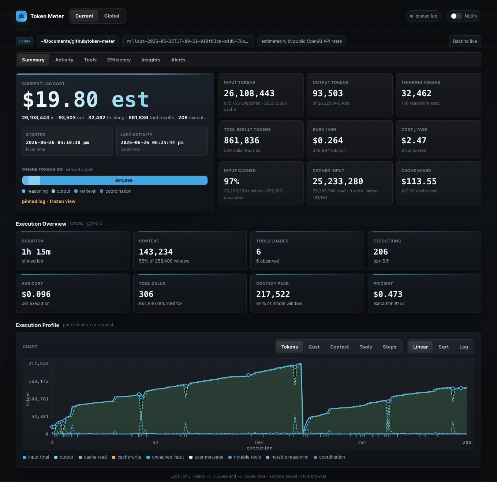
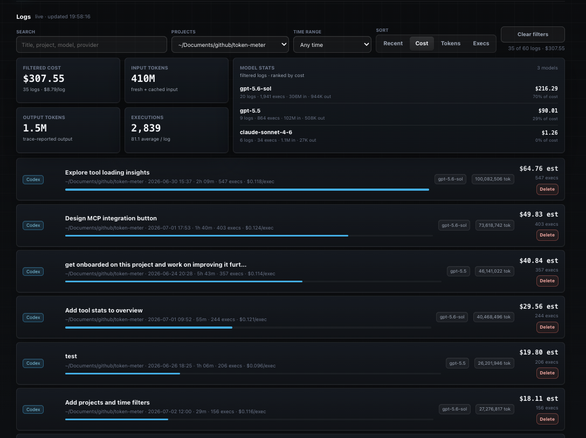
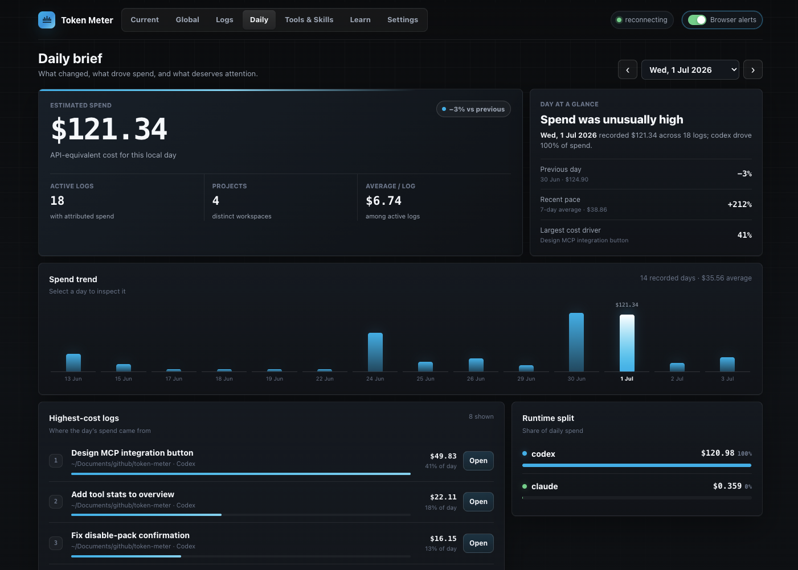
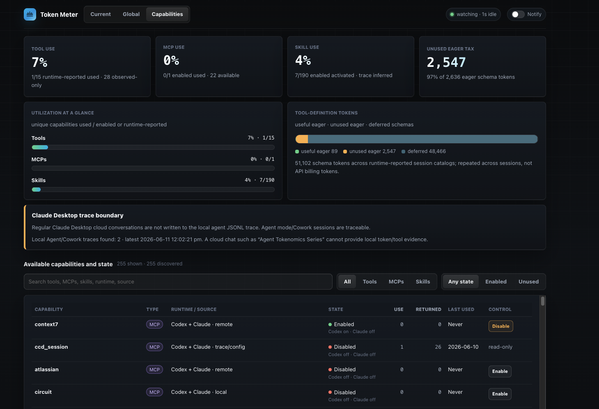
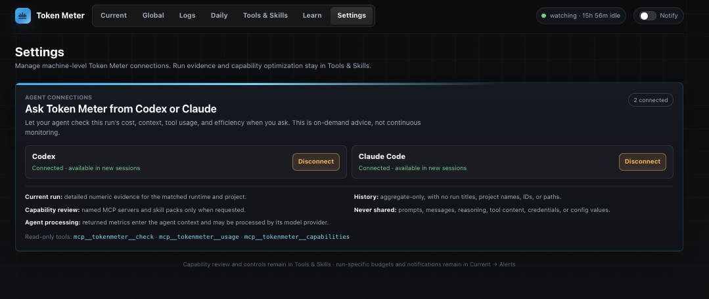
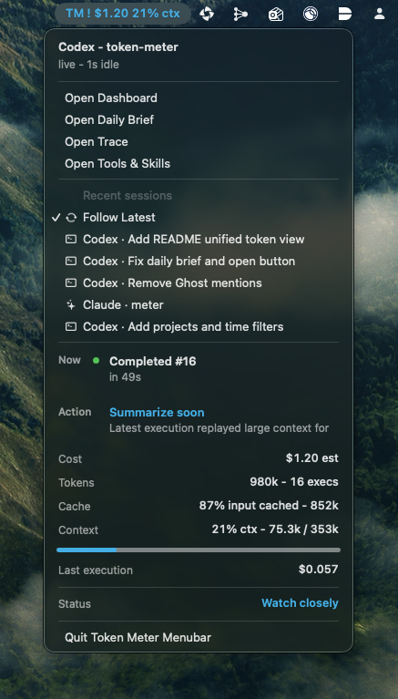

# Token Meter

Claude, Codex, and Cursor make it easy to start an agent session. They make it much
harder to understand what happened during the run, what it cost, and whether
your usage is changing over time. Token Meter reads their local traces and
turns them into one live dashboard.

## What you can do

| Area | What you get |
| --- | --- |
| **Follow a live run** | Open Sessions, choose a card, and follow tokens, estimated cost, context usage, wait time, response speed, tool calls, and budget alerts while an agent is working. |
| **Understand past usage** | Search runs from Claude, Codex, and Cursor together. Filter by project or time, review daily trends, and see what is driving cost and delays. |
| **Compare models** | See which app and model handled each run, compare similar workloads, and understand when there is not enough data for a reliable conclusion. |
| **Review tools and skills** | Find tools that return a lot of data, fail, or repeat work. See which available tools and installed skills were used—or left unused. |
| **Check provider limits** | Use the menu bar tabs—**Run · All · Claude · Codex · Cursor**—to see how much of each available Session, Weekly, named, or monthly limit you have used. It also shows reset times, likely run-out timing, data freshness, and notifications. If a provider does not report a limit, Token Meter says so instead of showing a misleading 0%. |
| **Manage a monthly budget** | Claude, Codex, and Cursor each start with a $1,000 monthly budget. Token Meter adds them into one machine-wide limit, and keeps any runtime overrun visible in session detail and the menu bar. |
| **Install updates explicitly** | Check the configured Git upstream once per hour by default. Token Meter shows a bottom-right update button when a clean fast-forward update exists and does not change the checkout until you click it. |
| **Ask your agent** | Let Codex or Claude check the current run, summarize usage, and point you to the relevant dashboard view through a local MCP. |
| **Move around quickly** | Open common views with the command palette and keyboard shortcuts. Definitions appear as tooltips on the metrics they explain. |
| **Keep data private** | Run analysis stays on your computer and Token Meter sends no telemetry. Limit checks use your existing account only to read usage from the matching provider. |

Token Meter supports Claude Code, Claude Desktop Agent/Cowork, Codex CLI, the
Codex desktop app, and Cursor Agent/Composer. It follows local agent logs as they are written and
combines live runs with cross-app history, so the answer is available while you
are working and after the session ends.

Local-only. Python standard library only. No API keys. No telemetry leaves your
machine.

## Quick Start

### Install From Terminal

On macOS or Linux, clone the repository and run its installer:

```bash
git clone https://github.com/Galileo-Agent-Labs/token-meter.git
./token-meter/scripts/install
```

The installer checks the required tools, installs the server and desktop tray
startup items, waits for the local server, verifies both endpoints, prints
`Token Meter installation complete`, and returns control to your terminal.
It starts the server first and lets the initial local-history index finish before
starting the menu bar or desktop tray, so large coding histories may take longer
on the first run without requiring a retry.
It copies a stable runtime outside the clone: the macOS default is
`~/Library/Application Support/Token Meter/runtime`; the Linux default is
`~/.local/share/token-meter/runtime`. The clone is not used for automatic startup.

Token Meter starts its local server and menu bar or desktop tray widget automatically after
installation and after future logins. Open the dashboard at:

```text
http://localhost:8722
```

Start a Claude, Codex, or Cursor run and Token Meter will follow its local log.

### Run Without Installing

For temporary development use, start Token Meter directly from a clone:

```bash
cd token-meter
./scripts/start-token-meter
```

This foreground workflow is separate from the persistent installer above.

## Visual Tour

### 1. Open A Session

Start on **Sessions** and choose a recent card. Inside that session, **Run**
shows estimated cost, prompt-to-response wait, context, input, output, and
output speed. Use **Activity**, **Tools**, **Insights**, and **Alerts** when you
need the underlying evidence or controls.

<p align="center">
  
</p>

### 2. Find Expensive Or Noisy Logs

Open **Logs** to search by title, project, model, or provider. Project and time
filters recalculate the cost, token, execution, wait-time, and model summaries
above the list. Sort by cost, tokens, or wait time to find the runs worth
reviewing first; opening a
row preserves that run as a frozen view, while Delete moves only its JSONL log
to macOS Trash after confirmation.

<p align="center">
  
</p>

### 3. Explain A Day's Spend

Open **Daily** to inspect a recorded local day. The brief compares spend with
the previous day and recent pace, identifies the largest cost driver, and breaks
the day down by project, runtime, highest-cost logs, and completed request wait.
Switch the trend between Spend and Wait, then select any day to see what changed.

<p align="center">
  
</p>

### 4. Inspect Tools, MCPs, And Skills

Open **Tools** to see the capabilities found across scanned Claude and
Codex logs. Compare observed use, returned tokens, last-use evidence, and eager
versus deferred catalog definitions. The view keeps MCP servers read-only and
limits review and disable actions to eligible user-installed skill packs.

<p align="center">
  
</p>

### 5. Configure Token Meter

Open **Settings** to connect the local, read-only `tokenmeter` MCP server to
Codex, Claude Code, or both. Token Meter previews the exact command and manages
only its own user-level entry. Connected agents can check the current run,
review aggregate usage, or inspect user-installed skill-pack hygiene; prompts,
reasoning, tool contents, credentials, and configuration values are never
returned.

The same view contains the complete monthly budget experience: individual
Claude/Codex/Cursor budgets that default to $1,000 each and are added into one
machine-wide total, month-to-date spend, runtime progress, projections after
three active spend days, up to 12 calendar months of history, and alert
thresholds. A runtime-specific overrun remains visible in session detail and as a red
warning symbol in the menu bar even when the combined total is still on track. When trace
coverage is partial, spend is labeled “at least” and remaining budget is not
presented as guaranteed headroom. Settings also holds model pricing and the
experimental Positive and Friction phrase groups. Language-signal edits are
recalculated across discovered sessions without retaining raw message text.
Start a new agent session after connecting the MCP.

<p align="center">
  
</p>

Per-session caps remain directly available in **Session → Run** as a slider
with an exact dollar field.

### 6. Keep The Live Signal In The Menu Bar

The macOS companion has five native tabs: **Run**, **All**, **Claude**,
**Codex**, and **Cursor**. Run keeps the current task's estimated cost, tokens,
context pressure, output speed, model, shortcuts, and recent-session picker.
All ranks fresh provider-reported limits and marks the most constrained one.
Each provider tab shows only the windows that provider actually reports, with
usage bars, reset countdowns, pace/runout guidance, freshness, and source.
When a common Session or Weekly window is absent, the tab says so explicitly;
missing means unreported or unavailable, never 0%. Named limits such as Codex
Spark remain separate from regular limits, and Cursor's monthly Plan cap is not
renamed as a session or weekly allowance.

The status-bar title defaults to **Cost + Output speed**. Under **Settings →
Menu bar title**, independently enable or disable Cost, Output speed, Context,
Model, and Limits; hovering always shows the complete available summary.
Quota notifications are on by default for new
installs, warn at 80% by default, always treat 95% and exhaustion as critical,
and report resets after a previously warned window rolls over. The first quota
observation establishes a baseline and never sends a catch-up notification.

<p align="center">
  
</p>

### A Good First Five Minutes

1. Install or start Token Meter, then begin a Claude, Codex, or Cursor task.
2. Open **Sessions**, choose a card, and check cost plus context pressure in
   **Run**.
3. Set a session budget in **Run**, and configure browser budget notifications
   under **Alerts**.
4. Review or change the default $1,000 Claude, Codex, and Cursor monthly budgets
   in **Settings → Monthly budget**; their sum becomes the machine-wide limit.
5. Connect Codex or Claude Code from **Settings** if you want on-demand answers
   inside the agent.
6. After a few runs, use **Logs** and **Daily** to compare apps and explain
   spend, then open **Tools** for capability evidence.

## Requirements

- Python 3.8 or newer.
- Claude Code CLI, Codex CLI, Claude Desktop Agent/Cowork, and/or the Codex
  desktop app if you want live log data.
- macOS: the Swift toolchain, usually from Xcode Command Line Tools.
- Linux: systemd user services, GTK 3, PyGObject, and Ayatana AppIndicator. KDE exposes AppIndicator items
  natively; GNOME requires an AppIndicator/KStatusNotifierItem shell extension (Ubuntu enables one by default).
- `curl`, used by the helper scripts.

The web dashboard has no third-party Python packages. `meter.py` uses only the
Python standard library. Dashboard-only mode is available for development and
troubleshooting, but the normal experience includes the macOS menu bar or Linux
desktop tray companion.

## Ask From Codex Or Claude

Open **Settings** and use the **Agent connections** panel to connect Codex,
Claude Code, or both. Token Meter shows the exact local command before it
changes configuration and manages only the user-level MCP entry named
`tokenmeter`. Start a new agent session after connecting.

The three client-visible tools are deliberately compact for crowded MCP lists:

- `mcp__tokenmeter__check` answers questions about the matched current run,
  including “Should I keep this run going?” and an optional execution drill-down.
- `mcp__tokenmeter__usage` reviews aggregate spend, models, tools, or change for
  today, 7 days, or 14 days.
- `mcp__tokenmeter__capabilities` reviews named user-installed skill packs
  without changing them.

The integration is read-only and on demand. Current-run detail is limited to
the caller's matched runtime and project. History is aggregate-only and omits
run titles, project names, session IDs, and paths. Prompts, messages, reasoning,
tool arguments, tool results, credentials, environment variables, and config
values are never returned.

Implicit current-run checks use the runtime's trace-recorded working directory
and refuse stale matches older than six hours. Older logs remain available only
through an explicit log selection or session link, so an abandoned run is not
described as the caller's latest execution.

When a tool is called, its derived result enters the connected agent's context
and may be processed by that client's model provider under the client's own
terms. Token Meter does not send trace content or derived analytics itself;
menu-bar quota sync separately makes read-only usage requests to the provider
accounts already signed in on this computer.

For source installs, the equivalent manual commands are:

```bash
codex mcp add --env TOKEN_METER_CALLER=codex tokenmeter -- "$PWD/scripts/run-token-meter-mcp"
claude mcp add --transport stdio --scope user tokenmeter --env TOKEN_METER_CALLER=claude -- "$PWD/scripts/run-token-meter-mcp"
```

Remove the connections with:

```bash
codex mcp remove tokenmeter
claude mcp remove tokenmeter --scope user
```

Connecting does not create background monitoring or interruptions. The tools
run only when the user or agent calls them; Token Meter's browser and menu-bar
alerts remain the proactive channels.

## Software Updates

**Check for updates every hour** is enabled by default in **Settings → Software
updates**. Token Meter immediately fetches revision metadata from the Git
upstream configured during installation, then checks again once per hour while
the server is running. The installer keeps a dedicated update checkout beside
the runtime so the background service does not need access to a development
checkout under a macOS-protected folder such as Documents. You can disable
these checks at any time. Checks do not merge, pull, reinstall, or send
telemetry.

When the managed checkout is clean, has not diverged, and is behind its upstream, a
**New update available** button appears at the bottom right of the dashboard.
Clicking it performs a fast-forward update, reruns the existing installer, and
reloads the dashboard after the local server restarts. If the checkout has
local changes or has diverged, Token Meter leaves it untouched and reports the
problem in Settings. The development checkout used for the original install is
not modified by the background checker or update button.

## Automatic Startup And Uninstall

On macOS, the installer creates separate user LaunchAgents for the local server
and menu bar companion. Both start after login and use `KeepAlive`. Remove them with:

```bash
"$HOME/Library/Application Support/Token Meter/runtime/scripts/uninstall-launch-agent"
```

On Linux, separate `token-meter-server.service` and `token-meter-tray.service`
user units provide the same supervision. Remove them with:

```bash
"${XDG_DATA_HOME:-$HOME/.local/share}/token-meter/runtime/scripts/uninstall-systemd-user"
```

Inspect either service with:

```bash
systemctl --user status token-meter-server token-meter-tray
```

## Dashboard-Only Mode

For development, troubleshooting, or headless use, run only the local web
dashboard:

```bash
python3 meter.py
```

The desktop companion polls the local `/menubar` endpoint. It shows compact status
for the active log and cached account quota snapshots. macOS presents tabs; Linux
presents equivalent provider submenus. Recent sessions show the provider plus the
session title or project, and the selected pin is kept in platform user
preferences. Choose `Follow Latest` to resume automatic
tracking.
The companion does not parse logs or read provider credentials directly.

## How It Finds Logs

Token Meter reads local log stores:

```text
Claude Code CLI:          ~/.claude/projects/*/*.jsonl
Claude Desktop metadata (macOS):  ~/Library/Application Support/{Claude,Claude-3p}/{claude-code-sessions,local-agent-mode-sessions}/**/local_*.json
Claude Desktop Agent (macOS):     ~/Library/Application Support/{Claude,Claude-3p}/local-agent-mode-sessions/**/.claude/projects/*/*.jsonl
Codex CLI + desktop app:   ~/.codex/sessions/YYYY/MM/DD/rollout-*.jsonl
Cursor transcript anchor:  ~/.cursor/projects/*/agent-transcripts/<composer-id>/<composer-id>.jsonl
Cursor conversation data (macOS):  ~/Library/Application Support/Cursor/User/globalStorage/state.vscdb
Cursor request timing (macOS):      ~/Library/Application Support/Cursor/logs/**/cursor.requestTraces.log
Claude Desktop data (Linux):        ~/.config/{Claude,Claude-3p}/...
Cursor conversation data (Linux):     ~/.config/Cursor/User/globalStorage/state.vscdb
Cursor request timing (Linux):         ~/.config/Cursor/logs/**/cursor.requestTraces.log
```

Claude Desktop metadata contains the Desktop title, project directory, model,
and a `cliSessionId`. Token Meter joins that id to the authoritative Claude
trace under `~/.claude/projects`, so Desktop sessions use the same validated
cost, token, tool, and execution parser without appearing twice. They are
labeled `Claude Desktop` in Sessions and Logs.

Agent/Cowork sessions use Claude Desktop's selected workspace folder when the
trace itself runs from the managed `outputs` directory. Sessions without a
selected workspace are joined to their nested JSONL and labeled `No project`.
Third-party-provider builds, including Bedrock-backed
Cowork, use the parallel `Claude-3p` application-support root and are discovered
the same way. A regular Claude Desktop cloud
conversation still is not written to the local agent JSONL store, so its tokens
and tool calls cannot be attributed reliably.

Codex CLI and the Codex desktop app use the same local session store, so Token
Meter discovers both through `~/.codex/sessions`.

Cursor uses the per-session transcript as the durable discovery anchor. Token
Meter joins its composer id to Cursor's shared SQLite state database for ordered
conversation bubbles, workspace, title, model, context estimates, tools, and
reasoning duration. It reads completed request-trace spans for prompt-to-finish
wait, active attempt time, TTFT, failures, and retries. The database is opened
read-only with WAL visibility; missing, busy, corrupt, or changed enrichment
data degrades to transcript-only parsing instead of hiding the session. Cursor
subagent composers are excluded from the top-level session list. Transcript
replicas with the same Composer ID are counted once, using the newest replica,
because Cursor can retain the same conversation under multiple window/workspace
folders.

It picks the newest source by session-specific activity time and recomputes
state whenever that source or its enrichment changes. Shared Cursor database
and request-log timestamps invalidate cached parsing but do not make every
Cursor session look equally recent.

Logs has a dedicated top-level tab. Clicking a log opens it as a frozen view at
`/sessions/<session-id>#summary`, so refreshing or sharing that local URL
restores the same log. Clicking the top-level `Sessions` tab or
`Back to sessions` removes the session path and returns to the recent-session
cards.

Dashboard tabs are addressable routes. The menu bar opens `#sessions` for Open
Dashboard when no session is pinned, `#summary` for a pinned session,
`#daily` for Open Daily Brief, `#activity` for Open Trace, and
`#capabilities` for Tools and `#settings-budgets` for monthly budget settings.
Session-detail panels keep their panel name in the hash. Logs use `#logs`.
Legacy `#current-sessions` redirects to `#sessions`, `#global*` routes redirect
to Logs, and `#budgets` redirects to `#settings-budgets`.

The top navigation follows the review sequence **Sessions → Logs → Daily →
Models → Tools → Learn → Settings**. Press **Command+K** on macOS or **Ctrl+K**
elsewhere to search every view plus session and Settings destinations.
**⌥1–7** opens the seven top-level views directly; ⌥1 returns to Sessions.

## What The Dashboard Shows

The Sessions tab is a concise list of runs active in the last 30 minutes.
Selecting a card opens that session with:

- Run: live cost, tokens, completed prompt-to-response wait, burn rate per
  active minute, cache behavior, context pressure, per-execution input/output
  trajectory, per-request wait history, session tool activity, optional
  skill-pack use, and unused user-installed packs. The first screen keeps cost,
  context, wait, input, output, and output speed visible; the rest is under a
  remembered Usage details disclosure. Gaps between prompts are
  excluded from wait time and burn rate. Observed wait timing also excludes
  trace-visible pauses where the agent asks for human input and waits for the
  answer.
- Activity: normalized event trace for messages, reasoning, tool calls, tool
  results, usage, coordination, and completion.
- Tools: tool and MCP usage by namespace and execution.
- Insights: plain-language log signals.
- Run: a browser-local per-session budget slider that starts at $10 for every
  new session and keeps an exact dollar field for precise caps.
- Alerts: session and monthly budget notifications plus browser delivery
  history.

The session header also offers Delete session. It uses the same confirmation
as Logs and warns when the selected session appears to still be live.

The Logs tab includes the searchable log inventory with an exact Projects
folder filter, rolling 24-hour, 7-day, 30-day, and 90-day activity ranges, and
Recent, Cost, Tokens, Executions, and Wait sorting. Filters persist in the browser.
Clear filters resets search, Projects, and time range without changing the
selected sort order.
The summary above the matching logs recalculates filtered cost, total input
(fresh plus cached), output tokens, executions, cumulative wait, and per-model
cost and token mix whenever any filter changes.
Each row has a Delete action. Deletion requires an explicit confirmation and
moves the exact discovered JSONL file to the system Trash so it remains recoverable.
Provider metadata, project files, and configuration are not changed.
Its live snapshot watches every discovered log, so a background Claude update
appears without waiting for a newer Codex session (or vice versa). If a browser
tab falls behind during a burst, Token Meter drops queued stale snapshots and
keeps the newest one instead of silently detaching the live stream.

The Tools tab includes:

- Prominent counts for enabled removable groups, groups used across scanned
  logs, review candidates, and observed MCP servers. MCP servers remain
  read-only; default tools, standalone skills, and built-in/runtime skill packs
  are excluded from removal candidates.
- An optimization insight that explains the user-installed skill packs needing
  review and can filter the inventory to those candidates.
- A tool-definition chart separating useful eager, unused eager, and deferred
  schema tokens across session catalogs.
- Searchable Tools, MCPs, and Skills inventory with sortable runtime, source,
  state, observed calls/activations, returned tokens, last use, and control
  columns, plus a runtime filter. Cursor tools are observed-only and read-only.
  Skill identifiers include runtime and origin or plugin pack so
  same-named built-in and user-installed skills remain distinct.
- Skill-pack enable/disable actions for configured Codex and Claude plugins.
  **Disable all unused** confirms and submits only the exact current
  review-candidate IDs. MCP servers, runtime-owned tools, and standalone skills
  are read-only.

To use it, open **Tools** in the dashboard or choose **Open Tools** from the
macOS menu bar companion. Start with the optimization insight
to review enabled removable groups with no observed use. Then search or filter
the inventory by Tools, MCPs, Skills, Enabled, Unused, or Review candidates.
The `Use`, `Returned`, and `Last used` columns provide the trace evidence for
deciding what to keep or disable. Deferred and default/read-only tools remain
visible as evidence but are not labeled removable waste.

Rows with an available skill-pack control can be enabled or disabled after
confirmation. Pack changes name the exact runtime control and affected skills,
then read the persisted Codex or Claude enabled value back before reporting
success. Restart Codex, Claude, or the relevant IDE after a change so it applies
to new sessions. A `read-only` row, including every MCP server, is observed by
Token Meter but cannot be changed from the dashboard.

Token Meter does not claim that every flagged token was billed waste. Returned
tokens are estimated from trace-visible text, embedded image/base64 bytes are
excluded, and a token is counted once in the flagged total even when it matches
multiple rules.

## Cost Notes

Claude costs are computed from the local `CLAUDE_PRICE` table in `meter.py`.
The bundled Claude list includes Opus 5 at $5 per million input tokens and $25
per million output tokens, with the standard cache multipliers represented as
$6.25 for cache writes and $0.50 for cached input. Prices can still be edited or
extended manually in Settings.
Codex costs are computed from the local `OPENAI_PRICE` table and are shown as
estimates because Codex subscription billing can differ from public API-rate
accounting. The bundled GPT-5.6 family rates per million tokens are Sol (and the
`gpt-5.6` alias) at $5 input, $0.50 cached input, and $30 output; Terra at $2,
$0.20, and $12; and Luna at $0.20, $0.02, and $1.20. Cache writes use 1.25 times
the uncached-input rate. GPT-5.6 requests above 272,000 input tokens use the
published 2x input and 1.5x output multipliers.

Built-in price changes are effective-dated. Token Meter prices every recorded
usage event with the period containing that event's timestamp, so reinstalling
after a provider price change does not rewrite older session estimates. A
session that crosses a price cutoff can therefore contain both rates. Manual
prices use the same period mechanism: Save, Add, Use default, and Retire start a
new period at the server's current time by default, preserving older session
estimates. An optional past `Effective from` time can align a manual change to a
known provider cutoff; future times are rejected. Settings shows the active
period beside each model. The unchecked `Apply to all history` option is the
explicit escape hatch for replacing a model's complete price timeline and
recalculating older estimates. Overrides saved by Token Meter versions before
this mechanism are migrated as all-history baseline periods, so upgrading alone
does not change their existing totals.

Cursor costs are intentionally rougher local estimates. Input uses one
trace-visible context snapshot per execution, with sparse intermediate
checkpoints interpolated between persisted values. Output uses deduplicated
assistant and thinking text at four characters per token. The persisted model
and speed variant select the rate; Composer 2.5 uses its separate Standard or
Fast rate. These values make Sessions, Logs, Daily, Models, MCP, and the
menu bar useful, but they are not a replacement for Cursor's billing dashboard.
Cache usage, hidden reasoning, and repeated internal model-call input are not
available locally. Token Meter therefore labels Cursor tokens, cost, and output
pace `est`, keeps cache unavailable, and does not fire budget alerts from the
Cursor proxy.

Pre-flight estimation is out of scope. Token Meter reads logs after usage is
recorded, so it shows cost as it accrues rather than predicting the next
execution.

## Privacy

Token Meter binds to `127.0.0.1` and serves only a local browser dashboard. It
does not send logs, prompts, responses, project paths, token counts, or
costs to any external service.

The menu-bar quota view makes read-only account-usage requests using credentials
already stored by Claude, Codex, or Cursor. Codex uses its local app-server when
available and otherwise its signed-in usage API; Claude uses Anthropic's OAuth
usage API only for first-party OAuth accounts; Cursor uses its account usage
summary. Third-party Claude authentication such as Bedrock is shown as
unavailable. Authentication tokens and cookies are never returned through
`/menubar`, written to Token Meter storage, included in errors, or sent to
another provider. Quota
responses are cached in memory and only normalized percentages, reset times,
plan labels, source labels, and freshness are exposed locally.

The dashboard can display local project paths, tool names, and trace metadata.
Do not expose the localhost page publicly unless you are comfortable sharing
that information.

Plugin-pack actions validate the exact discovered runtime control, update only
its enabled state in the local Codex or Claude configuration, and verify the
persisted value before refreshing the table. Token Meter does not mutate MCP
server configuration. Restart Codex, Claude, or the IDE after a successful
skill-pack change.

## Troubleshooting

### Port 8722 is already in use

Find the process:

```bash
lsof -nP -iTCP:8722 -sTCP:LISTEN
```

Stop the existing Token Meter process, or edit `PORT` in `meter.py`.

### The dashboard says no logs were found

Confirm that at least one of these directories exists and contains JSONL logs:

```bash
ls ~/.claude/projects
ls ~/.codex/sessions
ls ~/.cursor/projects
ls "$HOME/Library/Application Support/Cursor/User/globalStorage/state.vscdb"
```

Then run a supported Claude, Codex, or Cursor agent task and reload the
dashboard. A Cursor session needs its matching `agent-transcripts` JSONL; the
SQLite database and request logs are optional enrichment.

### Claude Desktop projects appear as Claude Code

Confirm Desktop metadata exists:

```bash
find "$HOME/Library/Application Support/Claude/claude-code-sessions" -name 'local_*.json'
```

Each metadata record must contain a `cliSessionId` matching a JSONL filename
under `~/.claude/projects`. Restart the source-tree Token Meter server after an
upgrade; an older installed server will not include the Desktop attribution
join.

### A Claude Desktop cloud conversation does not appear

Regular cloud chats do not produce the local agent JSONL that contains usage
and tool evidence. Start the task in Claude Desktop Agent mode/Cowork if you
need trace-backed Token Meter metrics. The Tools tab reports how many
local Agent/Cowork traces it found and the latest one it can attribute.

### The dashboard says `page.html` is missing

Token Meter serves the UI from `page.html`. Use a full repository clone and run
from the clone:

```bash
git clone https://github.com/Galileo-Agent-Labs/token-meter.git
./token-meter/scripts/install
```

If you copied `meter.py` somewhere else, copy `page.html` into that same folder
too, or start the server from the repository root.

If you already started Token Meter from the wrong directory, the old server may
still be running. Stop the process listening on port `8722`, then start again:

```bash
lsof -nP -iTCP:8722 -sTCP:LISTEN
kill <PID>
./scripts/start-token-meter
```

### Browser notifications do not appear

Use the notification toggle in the top-right of the dashboard. If notifications
were previously blocked for `localhost`, clear the block in browser site
settings and toggle notifications again.

### The desktop companion will not start

On macOS, check that `swiftc` is available:

```bash
swiftc --version
```

On macOS, install the Xcode Command Line Tools if needed:

```bash
xcode-select --install
```

On Linux, install the tray dependencies for your distribution:

```bash
# Debian / Ubuntu
sudo apt install python3-gi gir1.2-ayatanaappindicator3-0.1

# Fedora
sudo dnf install python3-gobject libayatana-appindicator-gtk3

# Arch Linux
sudo pacman -S python-gobject libayatana-appindicator
```

KDE Plasma displays the tray item through StatusNotifier. On GNOME, enable an
AppIndicator/KStatusNotifierItem shell extension if the item does not appear.
Check service logs with `journalctl --user -u token-meter-tray.service -n 50`.

## Validate

Run these checks from the repository root:

```bash
PYTHONPYCACHEPREFIX=/tmp/token-meter-pycache python3 -m py_compile meter.py token_meter_mcp.py menubar/token_meter_tray.py
bash -n scripts/*

# macOS companion
swiftc menubar/TokenMeterMenuBar.swift -o /private/tmp/token-meter-menubar
TOKEN_METER_MENUBAR_SMOKE=1 /private/tmp/token-meter-menubar
node -e "const fs=require('fs'); const html=fs.readFileSync('page.html','utf8'); const m=html.match(/<script>([\\s\\S]*)<\\/script>/); new Function(m[1]); console.log('js ok')"
python3 -c 'import meter; st=meter.recompute(meter.newest_source()); print(st["provider"], st["turns"], len(st["trace"]), st["tools"]["total_calls"])'
```

The final command requires at least one supported local Claude, Codex, or Cursor log.

## Repository Layout

```text
.
|-- meter.py                         # local HTTP server, log parsers, pricing, SSE
|-- page.html                        # single-file dashboard UI
|-- images/
|   |-- dashboard.png                # README dashboard screenshot
|   |-- daily.png                    # README daily spend screenshot
|   |-- logs-filtering.png           # README log review screenshot
|   |-- mcp.png                      # README agent connection screenshot
|   |-- tool-analytics.png           # README tools and skills screenshot
|   `-- menu-bar-widget.png          # README menu bar screenshot
|-- menubar/
|   |-- TokenMeterMenuBar.swift      # native macOS menu bar companion
|   `-- token_meter_tray.py          # Linux KDE/GNOME AppIndicator tray
|-- scripts/
|   |-- install                      # install the local runtime and login items
|   |-- run-menubar                  # build and run the menu bar companion
|   |-- start-token-meter            # start server if needed, then menu bar
|   |-- install-launch-agent         # install macOS login items
|   |-- uninstall-launch-agent       # remove macOS login items
|   |-- install-systemd-user         # install Linux user services
|   `-- uninstall-systemd-user       # remove Linux user services
|-- REQUIREMENTS.md                  # product rationale and historical notes
|-- CONTRIBUTING.md
|-- SECURITY.md
|-- LICENSE
`-- README.md
```

## Before Publishing On GitHub

Commit the app source, scripts, images, and public docs:

```text
README.md
LICENSE
meter.py
page.html
images/dashboard.png
images/daily.png
images/logs-filtering.png
images/mcp.png
images/tool-analytics.png
images/menu-bar-widget.png
menubar/TokenMeterMenuBar.swift
scripts/
REQUIREMENTS.md
CONTRIBUTING.md
SECURITY.md
.gitignore
```

Do not commit local runtime artifacts such as `.DS_Store`, `*.log`,
`__pycache__/`, or `.build/`. The included `.gitignore` covers those files.

## License

MIT. See [LICENSE](LICENSE).
