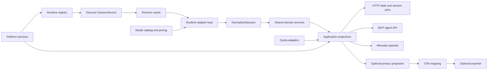

# Design: Extensible Runtime, Model, Platform, and Telemetry Architecture

Status: Implemented; native host matrix gaps recorded  
Date: 2026-08-10  
Requirements: [requirements.md](requirements.md)

## 1. Overview

Refactor Token Meter into a small composition facade plus explicit runtime, model, quota, platform, domain, service, client-contract, and optional telemetry boundaries. Preserve all current external behavior while moving one coherent responsibility at a time behind parity tests.

The central rule is:

> Runtime adapters translate proprietary evidence into Token Meter's normalized domain. Shared services compute product behavior. Platform adapters own OS behavior. OpenTelemetry maps at the boundary only.

This is a modular monolith, not a distributed plugin framework. Registries are explicit Python data structures, the default server remains dependency-free, and all components run in the existing process.

## 2. Current-state evidence

At design time:

- `meter.py` is 11,381 lines and contains discovery, four runtime parsers, pricing, quota access, settings, domain calculations, updates, deletion, HTTP routing, and watch/cache behavior.
- `page.html` is 4,888 lines and includes runtime-specific presentation logic.
- `tests/test_meter.py` is 6,051 lines and mixes unit, contract, UI-source, installer, and Swift-source assertions.
- runtime identities are enumerated in global tuples such as `MODEL_PRICE_PROVIDERS` and `BUDGET_PROVIDERS`;
- `all_session_sources()` and `recompute()` perform provider-oriented orchestration;
- `recompute_cursor()`, `recompute_opencode()`, `recompute_claude()`, and `recompute_codex()` combine source parsing with normalization and product calculations;
- `token_meter_mcp.py` imports the `meter` module directly;
- installers stage explicit root files, so a new package needs an intentional staging contract.

The OpenCode addition and pending Kiro change both add large provider-specific regions to `meter.py`. The Kiro change also demonstrates why runtime and model-provider identities cannot be synonyms: Kiro evidence may describe models priced by a different provider. The Windows change is primarily platform lifecycle and native-tray work and should not need to fork runtime parsing.

## 3. Architectural decisions

### DEC-001 — Use four independent identity axes

Use stable identifiers for:

| Axis | Example | Owns |
|---|---|---|
| Runtime | `kiro` | Trace format, discovery, source revision |
| Model provider | `anthropic` | Model aliases and pricing history |
| Account provider | `anthropic` | Bounded quota/account lookup |
| Platform | `windows` | Paths, processes, services, installer, tray |

The existing external field named `provider` remains a compatibility projection of `runtime_id` until a separately versioned API migration is approved.

### DEC-002 — Use an internal normalized domain, not the OTel schema

The internal domain must preserve Token Meter-specific facts such as evidence basis, cache-write tokens, active-duration derivations, pricing basis, runtime-scoped identity, session deletion policy, and private source locators. OpenTelemetry semantic conventions are an evolving interoperability schema and do not cover all these responsibilities.

A one-way mapper may convert a safe subset of normalized aggregates to OTel. OTel field changes must stop at this mapping layer.

### DEC-003 — Prefer explicit registries over magic discovery

Runtime, quota, and platform implementations are registered in code. Do not scan directories, import third-party code dynamically, or execute user-provided plugins. This keeps startup deterministic and the security surface bounded.

### DEC-004 — Preserve `meter.py` as the compatibility facade

`meter.py` remains the executable and import surface while becoming a small composition root. During migration it re-exports moved names that are currently used by tests, scripts, or `token_meter_mcp.py`. Re-exports are removed only through a separately approved compatibility change.

### DEC-005 — Make client rendering metadata-driven

Runtime labels, capabilities, default colors, and symbol keys come from a bounded catalog included in existing payloads. Browser and native clients keep local accessible fallback rendering. A new runtime should appear in generic session surfaces even before a custom icon exists.

### DEC-006 — Keep native trays platform-specific

Swift/AppKit, Linux tray, and Windows tray implementations remain platform-native. They consume the same `/menubar` contract and runtime catalog, but they are not forced behind a single UI framework.

### DEC-007 — Port Kiro and Windows after the seams exist

The pending changes are treated as feature references and test inputs. Their behavior is ported onto the new boundaries after the foundation is stable; they are not merged and refactored in place.

### DEC-008 — Cache recursive path enumeration, not active evidence

Context: Profiling 347 local sessions showed a 65.703 ms warm discovery median. Recursive Claude Desktop metadata and Cursor request-log globs accounted for most of the work and were repeated by the 0.5-second watcher even when the directory inventory was unchanged.

Options:

1. Parallelize all runtime adapters. This adds thread, SQLite, ordering, and failure complexity without addressing repeated directory enumeration.
2. Slow the whole watcher. This lowers work but delays active-session updates and changes current responsiveness.
3. Cache only recursive path lists for a short bounded interval while continuing to inspect known files and database revisions normally.

Decision: Use option 3 with a two-second TTL and 32-entry maximum. Cache Cursor metadata rows by database and WAL signatures, returning detached top-level rows to callers.

Rationale: This directly removes the profiled work, preserves deterministic adapter order, and keeps known-file revisions fresh on every discovery call. New recursively located files may appear up to two seconds later, which remains bounded and shorter than cross-session aggregation refresh windows.

Consequences: Unit tests inject time into the path cache; integration tests prove known-file updates remain immediate and database changes invalidate metadata. Benchmarks are recorded as evidence, not timing assertions in the unit suite.

### DEC-009 — Resolve duplicate logical session IDs deterministically

Context: Codex may emit multiple trace segments carrying the same logical session ID, including short completed review traces and a longer active task trace. Current-session aggregation already collapses these rows, but the detail route historically returned the first filesystem-discovery match. After the adapter migration, one live ID resolved to a two-execution review segment while its Current Sessions card represented the active trace with more than one thousand checkpoints.

Options:

1. Keep first-match lookup. This is fast but arbitrary and makes card-to-detail navigation incorrect when discovery order changes.
2. Encode a physical locator in public URLs. This removes ambiguity but exposes storage concerns and breaks existing session routes.
3. Rank matching sources through their cached safe summaries: prefer non-terminal work, then the newest activity, with a deterministic locator tie-breaker. Preserve an exact physical filename/stem match when a caller supplies one.

Decision: Use option 3 in the shared session selector.

Rationale: It preserves existing logical-ID URLs, matches the established current-session preference for active work, uses the bounded summary cache, and requires no runtime-specific HTTP branch.

Consequences: A duplicate logical ID performs summary lookup only for its matching candidates. Single matches retain the fast path. Explicit physical aliases remain exact, while logical-ID links consistently open the active or newest segment.

Implementation note (2026-08-11): `find_session()` now collects physical and logical matches separately. A unique physical alias or single logical match returns without summary work; duplicate logical matches use cached summary terminal state, activity revision time, and a stable locator tie-breaker. The reported three-segment Codex ID now resolves to its active `gpt-5.6-sol` trace in both the card and detail route.

### DEC-010 — Separate evidence activity from storage revision

Context: Claude Desktop can rewrite or touch an existing JSONL trace and its metadata file when a user merely opens historical UI state. The file signatures change, but no user/model event is added and metadata `lastActivityAt` does not advance. Treating filesystem mtime as activity makes old sessions appear in the 30-minute Current Sessions window.

Decision: Claude discovery SHALL derive `activity_mtime` from the newest bounded trace-event timestamp and Claude Desktop's semantic `lastActivityAt`, while `SourceRevision` continues to use file mtime/size signatures. The timestamp reader SHALL inspect only a bounded tail and cache by file signature so live discovery does not rescan complete traces.

Rationale: Current Sessions is an activity surface, not a recently-opened-files surface. Separating these clocks preserves cache invalidation and metadata refresh without inventing interaction.

Consequences: Opening an old session may invalidate its cached projection but cannot promote it into Current Sessions. A newly appended trace event or advancing `lastActivityAt` still updates activity immediately. If bounded evidence contains no timestamp, activity remains unavailable rather than falling back to a misleading current file mtime.

Implementation note (2026-08-11): `ClaudeRuntimeAdapter` now caches only the newest timestamp found in a bounded 1 MiB JSONL tail by file signature, with a 512-source limit. Desktop activity is the maximum of that trace timestamp and semantic metadata `lastActivityAt`; legacy `signature_mtime` separately retains trace/metadata filesystem invalidation. Claude Code sources without Desktop enrichment preserve their existing file-activity behavior.

### DEC-011 — Reconcile upstream fixes at their architectural owners

Context: merged upstream PR #16 bounds OpenCode cross-session matched-pace work and avoids rebuilding cross-session state on session-detail requests. Merged PR #15 makes native HTML select controls readable on Linux. Both patches target the pre-refactor monolith, while the same responsibilities now live in runtime, domain, application, and dashboard boundaries.

Decision: preserve the upstream behavior without restoring monolithic implementations. The OpenCode message limit belongs in `token_meter/runtimes/opencode.py`; workload and matched-pace sample limits belong in `token_meter/domain/aggregates.py`; session-detail snapshot reuse belongs in `token_meter/app.py`; and select-control colors remain in `page.html`. Limits SHALL be named constants, exact totals SHALL remain uncapped, newest OpenCode messages SHALL be restored to chronological processing order, and the dashboard SHALL preserve distinct search-input styling while giving native selects an explicit dark color scheme.

Rationale: a textual conflict choice would either discard production fixes or move extracted behavior back into `meter.py`. Porting each invariant to its owner preserves the extension architecture, makes the performance limits directly testable, and keeps the Linux fix platform-neutral enough for macOS browsers.

Consequences: the merge commit can retain both upstream commits in history even though conflicted monolith hunks are re-expressed in extracted modules. The full portable suite protects backend behavior; embedded JavaScript parsing and browser checks protect dashboard compatibility. Linux-native visual evidence remains a host-matrix item because this reconciliation host is macOS.

Implementation note (2026-08-11): merge commit `c2a6f78` contains both upstream commits. `SUMMARY_MESSAGE_LIMIT`, `WORKLOAD_SAMPLE_LIMIT`, and `MATCHED_PACE_SAMPLE_LIMIT` enforce the new bounds in their owning modules; the `/session` handler reuses `_xsess["data"]` when present; and PR #15's select styling remains in `page.html`. Direct tests failed at 501 OpenCode turns, 4,200 workload observations, 2,100 pace observations, and one unnecessary rebuild before the port, then passed with the intended 500/2,000/500 bounds and unchanged exact totals.

### DEC-012 — Consolidate local feature branches by behavioral equivalence

Context: after the source migration, two older local lines still appeared to
contain commits not reachable from `main`: 11 OpenCode commits on
`codex/pr-14-opencode-fixes` and five Windows commits ending at `a1295c0`.
Both lines predate the package extraction, so merging their `meter.py` changes
would restore runtime and platform decisions to the compatibility facade.

Decision: prove whether each line's behavior is already present before porting
anything. Treat an aggregate stable patch-ID match as exact OpenCode retention.
For Windows, compare every lifecycle artifact and map the remaining behavior to
platform, quota, packaging, dashboard, and native-tray contracts. Port only an
observable gap with a failing test; do not merge obsolete implementation text.

Rationale: the aggregate patch from the OpenCode branch and mainline squash
commit `7dcf8e7` have the same stable patch ID
`4e2de2bd8b7f139ac1ca35ca8e1450bb8535eaf6`. The Windows launcher, starter,
uninstaller, and updater are byte-identical to the detached branch. The current
installer retains the old transactional per-user lifecycle while staging the
shared manifest, and the current tray retains the custom icon and left-click
behavior while obtaining labels from the runtime catalog. Windows paths,
recoverable trash, detached process flags, and provider-CLI `CREATE_NO_WINDOW`
behavior now live in their architectural owners and have direct contracts.

Consequences: neither historical branch requires a textual merge or a new
production port. Their behavior remains in `main` without reintroducing the
monolith. The old refs may remain temporarily for review and recovery; ancestry
alone is not used as evidence of a missing feature.

## 4. Target package structure

```text
meter.py                         # compatibility facade and composition root
token_meter_mcp.py               # stable MCP entrypoint
token_meter/
  __init__.py
  app.py                         # component wiring and application lifecycle
  contracts.py                   # public immutable domain and adapter types
  runtimes/
    base.py                      # RuntimeAdapter protocol
    registry.py                  # explicit runtime registry
    claude.py
    codex.py
    cursor.py
    opencode.py
    kiro.py                      # added only after the foundation lands
  models/
    catalog.py                   # aliases and canonical ModelRef construction
    pricing.py                   # dated price tables and PriceQuote results
  quotas/
    base.py                      # QuotaAdapter protocol
    registry.py
    anthropic.py
    openai.py
    cursor.py
  platforms/
    base.py                      # paths/process/trash capability protocol
    registry.py
    macos.py
    linux.py
    windows.py                   # added with the Windows port
  domain/
    usage.py
    timing.py
    tools.py
    insights.py
    aggregates.py
  services/
    sessions.py                  # discovery, revision cache, load orchestration
    settings.py
    budgets.py
    capabilities.py
    updates.py
    deletion.py
    menubar.py
    agent_api.py
  telemetry/
    privacy.py                   # deny-by-default export projection
    otel_mapping.py              # version-pinned attribute mapping
    exporter.py                  # optional dependency boundary
  web/
    server.py                    # HTTP transport and compatibility routes
tests/
  contracts/
  domain/
  runtimes/
  platforms/
  integration/
  fixtures/
```

This is a target layout, not a demand to create empty files up front. A package is introduced only when the first coherent responsibility moves into it.

## 5. Core contracts

Use frozen dataclasses and `typing.Protocol` so implementations remain standard-library-only.

### 5.1 Identity and evidence

```python
@dataclass(frozen=True)
class ModelRef:
    provider_id: str
    model_id: str
    variant: str | None = None


class EvidenceBasis(Enum):
    MEASURED = "measured"
    INFERRED = "inferred"
    ESTIMATED = "estimated"
    UNAVAILABLE = "unavailable"


@dataclass(frozen=True)
class EvidenceValue(Generic[T]):
    value: T | None
    basis: EvidenceBasis
```

Invariant: `UNAVAILABLE` always has `value=None`; zero is valid only when the adapter has evidence for zero.

### 5.2 Session source

```python
@dataclass(frozen=True)
class SessionSource:
    runtime_id: str
    client_id: str
    session_id: str
    display_label: str
    project: str | None
    locator: SourceLocator        # internal-only, never publicly serialized
    activity_mtime: float
    revision: SourceRevision
    model_ref: ModelRef | None
```

`SourceLocator` is an opaque adapter-owned value. Shared services may cache it but must not interpret or serialize it.

### 5.3 Normalized session

```python
@dataclass(frozen=True)
class NormalizedSession:
    source: SessionSource
    started_at: datetime | None
    ended_at: datetime | None
    usage: UsageEvidence
    timing: TimingEvidence
    tools: tuple[ToolEvent, ...]
    turns: tuple[TurnSummary, ...]
    pricing_basis: PricingBasis | None
    capabilities: frozenset[str]
    warnings: tuple[ParseWarning, ...]
```

Raw prompt, response, reasoning, and tool payload content is not part of the normalized contract. If parsing needs content transiently to derive a metric, it must discard the content before returning the normalized session.

### 5.4 Runtime adapter

```python
class RuntimeAdapter(Protocol):
    descriptor: RuntimeDescriptor

    def discover(self, context: DiscoveryContext) -> Iterable[SessionSource]: ...
    def current_revision(self, source: SessionSource) -> SourceRevision: ...
    def load(self, source: SessionSource, detail: DetailLevel) -> NormalizedSession: ...
    def deletion_plan(self, source: SessionSource) -> DeletionPlan: ...
```

`RuntimeDescriptor` contains stable identity, label, supported evidence/capabilities, default presentation tokens, and deletion policy. It does not contain credentials or host paths.

### 5.5 Runtime registry

```python
RUNTIMES = RuntimeRegistry([
    ClaudeRuntime(...),
    CodexRuntime(...),
    CursorRuntime(...),
    OpenCodeRuntime(...),
])
```

The registry validates unique IDs on construction. Discovery iterates registered adapters and records bounded adapter errors. It contains no `if runtime_id == ...` branches.

### 5.6 Pricing

```python
@dataclass(frozen=True)
class PriceQuery:
    model: ModelRef
    observed_at: datetime | None


@dataclass(frozen=True)
class PriceQuote:
    model: ModelRef
    input_per_million: float | None
    output_per_million: float | None
    cache_read_per_million: float | None
    cache_write_per_million: float | None
    basis: EvidenceBasis
    matched_rule: str | None
```

Runtime adapters construct or resolve a `ModelRef`; they do not pass their `runtime_id` as an implicit price provider.

Implementation note (2026-08-10): the pricing contract retains floating-point rates because the existing settings, HTTP payloads, cost calculations, and compatibility tables are float-based. This is a representational compatibility choice, not a change in price arithmetic. `token_meter/models/catalog.py` owns canonical provider mappings, bundled rates, defaults, and built-in history; `token_meter/models/pricing.py` owns provider-scoped exact matching and effective-history resolution. The `meter.py` facade preserves legacy fallback/approximation policy and settings persistence.

Exact `PriceQuery` resolution never searches another provider. The legacy Cursor compatibility path may still try Cursor, OpenAI, and Anthropic tables in its established order and always marks the result approximate. Unknown exact providers/models return `EvidenceBasis.UNAVAILABLE` with no rates or matched rule.

Hot compatibility lookups reuse bounded immutable query/quote objects. Settings writes invalidate immediately; external settings-file edits are observed after a maximum 250 ms mtime-check window, avoiding a filesystem `stat()` for every usage event.

### 5.7 Quotas

```python
class QuotaAdapter(Protocol):
    account_provider_id: str

    def fetch(self, request: QuotaRequest) -> QuotaResult: ...
```

Authentication, bounded timeouts, response sanitization, and provider-specific response parsing stay in quota modules. Runtime support does not depend on quota support.

Implementation note (2026-08-11): `token_meter/quotas/registry.py` now registers quota capability by canonical account provider (`anthropic`, `openai`, or `cursor`) and separately exposes the legacy public identifiers (`claude`, `codex`, or `cursor`). Provider request construction and parsing live in `anthropic.py`, `openai.py`, and `cursor.py`; common normalization and a 2 MiB bounded HTTP reader live in `common.py`. `meter.py` retains compatibility wrappers so current tests, patches, endpoint payloads, and unavailable states remain unchanged. A runtime with no account provider has no quota adapter and continues to support local usage estimates.

### 5.8 Platform services

```python
class PlatformServices(Protocol):
    platform_id: str

    def resolve_paths(self, environment: Mapping[str, str]) -> PlatformPaths: ...
    def process_options(self, purpose: ProcessPurpose) -> ProcessOptions: ...
    def trash_plan(self, paths: Sequence[Path]) -> TrashPlan: ...
    def capabilities(self) -> PlatformCapabilities: ...
```

Installers and tray applications remain native artifacts. They share a packaging manifest and public server contracts rather than importing Python platform internals.

Implementation note (2026-08-11): `token_meter/platforms/` now detects a host once and returns immutable macOS, Linux, or unsupported capability results. Platform modules own XDG/Application Support path precedence, detached-process policy, trash command/directory selection, and user-visible trash labels. `meter.py` keeps its historical path constants as projections from the selected platform for compatibility, but update launch and session deletion no longer decide operating-system behavior. Linux behavior is covered portably from macOS; native Linux validation remains an explicit coverage gap.

### 5.9 Runtime packaging manifest

`runtime-manifest.txt` is the one source of truth for root entrypoints, optional documents, the complete Python package, native companions, scripts, and assets. `python-tree` expands every Python source file under `token_meter/`; ordinary module additions therefore need no duplicate installer edits. `token_meter/packaging.py` rejects absolute and parent-traversing targets, validates required source entries before service changes, and compares every manifest-owned staged file byte-for-byte after native copying. The macOS, Linux, and Windows installers parse the same manifest and invoke the same validator.

### 5.10 Usage and cost domain

`token_meter/domain/usage.py` owns typed `UsageEvidence` plus `PriceQuote` cost calculation, token/cache totals, authoritative reported-cost allocation, cache metrics/savings, availability, and reported/local-estimate provenance. Missing evidence remains unavailable while measured zero remains available. Compatibility wrappers in `meter.py` translate established dictionaries and keep raw-event interpretation outside the domain. A fast normalized-count projection uses the same pure arithmetic kernel on legacy hot paths; it avoids allocating temporary evidence objects for every trace event.

`token_meter/domain/timing.py`, `tools.py`, and `insights.py` own interval merging, typed timing projection, wait/throughput summaries, payload-free tool categorization and rollups, capability-pack measurement/review rules, and normalized recommendation ordering/thresholds. Runtime parsers are responsible for converting raw events into these facts. Unknown, instruction-only, mixed, or unscanned capability evidence cannot become a review candidate; native skill evidence is accepted only through an explicit normalized `skills` list rather than names or text mentions.

`token_meter/domain/aggregates.py` owns daily, monthly, current-session, tool, model, language-signal, and cross-session rollups. Runtime identifiers are opaque inputs, and model rows are keyed by runtime plus model reference. The composition layer injects compatibility-only runtime labels, metric availability defaults, throughput finalization, and workload matching; discovery, trace loading, cache refresh, settings, and HTTP projection never enter the domain module. Workload-distance results are cached only for the duration of one model-pair comparison across the 7/30/90/all windows, bounding memory while avoiding duplicate statistical work.

The OpenCode implementation proves the database-backed adapter shape. `token_meter/runtimes/opencode.py` owns its SQLite locator, WAL-aware query-only connections, source cache/revisions, model metadata, normalized evidence, and legacy projection algorithms. Its normalized loader selects only JSON metadata needed for tokens, timing, and tool names; it does not select message or part content. The temporary compatibility projection receives existing UI/state builders as injected callables, keeping transport and presentation dependencies out of native discovery and normalized loading. A lightweight proxy keeps the registry stable while resolving the current configured database path per operation.

The Cursor implementation proves that one adapter can combine file and shared-database evidence without leaking storage details. `token_meter/runtimes/cursor.py` owns transcript discovery, Composer SQLite joins, bounded request-trace timing, normalized estimated usage, and transcript fallback. Its `SourceRevision` combines only the selected transcript, selected Composer header, and matching request spans; the shared database file signature is used to refresh the metadata index but not as every session's revision. This prevents one Composer update from invalidating unrelated sessions. A bounded path cache accelerates repeated discovery while known file mtimes and database signatures are still checked independently.

The Codex implementation proves the JSONL adapter shape and the runtime/model-provider split. `token_meter/runtimes/codex.py` reads model-provider identity from session metadata, using the configured compatibility default only when evidence is absent; it never derives model provider from the `codex` runtime identifier. Trace and external index revisions are combined without exposing either locator. The normalized loader accumulates token checkpoints, explicit task timing, and payload-free tool identities while discarding prompts, messages, reasoning text, arguments, results, and tool definitions from its returned contract.

## 6. Component flow



### Discovery and load sequence

1. `Application` asks the runtime registry to discover sources with platform-resolved paths.
2. Each adapter returns bounded `SessionSource` objects or bounded discovery errors.
3. `SessionService` compares source revisions with the existing cache.
4. Only changed sources are loaded by their owning adapter.
5. The adapter returns `NormalizedSession`; contract validation runs at the boundary.
6. Shared domain services calculate projections.
7. Compatibility serializers reproduce current endpoint and MCP shapes.

### Failure isolation

- One source failure produces a bounded warning associated with runtime and session ID.
- One runtime discovery failure does not abort other adapters.
- Pricing failure produces unknown/estimated pricing state without dropping measured usage.
- Quota failure does not affect local sessions.
- Optional exporter failure is recorded locally with bounded metadata and never blocks the application path.
- Runtime discovery/load failures use stable runtime, operation, and error-code fields only; raw exception text and paths are discarded.

## 7. Client contract

Add a bounded `runtime_catalog` object to `/state` and the subset needed by `/menubar`. Avoid a new top-level dashboard route.

Example:

```json
{
  "runtime_catalog": {
    "claude": {
      "label": "Claude",
      "symbol": "runtime.claude",
      "color": "runtime-1",
      "capabilities": ["sessions", "models", "tools", "quota"]
    },
    "unknown-runtime": {
      "label": "Unknown Runtime",
      "symbol": "runtime.generic",
      "color": "runtime-neutral",
      "capabilities": ["sessions"]
    }
  }
}
```

The catalog is presentation metadata, not arbitrary HTML, CSS, image URLs, shell commands, or executable configuration. Existing client mappings remain as compatibility fallbacks until metadata-driven rendering is proven at wide-desktop, 1024-pixel-laptop, and native-tray sizes.

## 8. OpenTelemetry boundary

### What OpenTelemetry simplifies

- interoperable naming for runtime/model/token/duration/tool signals where conventions exist;
- a standard optional export pipeline and collector ecosystem;
- correlation of Token Meter aggregates with traces produced elsewhere;
- future ingestion from runtimes that already emit compatible OTLP data.

### What it does not replace

- Claude/Codex/OpenCode/Kiro file discovery and parsing;
- Cursor SQLite joins and revision logic;
- runtime-specific deduplication and session boundaries;
- pricing histories and model alias rules;
- quota/account APIs;
- budgets, update checks, deletion, HTTP/MCP compatibility, installers, or tray applications.

### Mapping policy

`telemetry/privacy.py` first projects a normalized session or aggregate into a small export-safe object. `telemetry/otel_mapping.py` then maps that object to a pinned convention version. The exporter never receives the full normalized session.

Initial allowlist candidates:

- runtime identifier;
- canonical model provider and model ID;
- measured input/output/cache token counts;
- bounded duration values and their evidence basis;
- aggregate tool-category counts, excluding names, arguments, and results;
- Token Meter version and operating-system family.

Always denied:

- prompts, responses, reasoning, system instructions;
- tool definitions, arguments, results, and MCP payload contents;
- credentials, account identifiers, quota response bodies;
- local paths, session locators, database contents, raw trace events;
- project names or session labels unless a later privacy review explicitly approves a transformed value.

The first implementation should provide the pure privacy projection and mapping tests. An actual exporter is a later optional milestone with an extra dependency. OTLP input is deferred until a specific runtime and schema justify it.

Implementation note (2026-08-11): the pure seam is implemented in `token_meter/telemetry/`. It pins GenAI semantic conventions `1.42.0`, maps input/output counts to `gen_ai.client.token.usage`, and uses `token_meter.*` names for cache tokens, whole-session active duration, and category-only tool counts because those aggregates are not semantically identical to a single GenAI client operation. `telemetry-decision.md` selects mapping-only scope: no SDK, exporter, telemetry setting, or output side effect is present.

Relevant upstream references:

- [OpenTelemetry GenAI semantic conventions repository](https://github.com/open-telemetry/semantic-conventions-genai)
- [GenAI span conventions](https://github.com/open-telemetry/semantic-conventions-genai/blob/main/docs/gen-ai/gen-ai-spans.md)
- [OpenTelemetry Python exporters](https://opentelemetry.io/docs/languages/python/exporters/)
- [Collector file-log receiver](https://github.com/open-telemetry/opentelemetry-collector-contrib/blob/main/receiver/filelogreceiver/README.md)

## 9. Security and privacy design

- Keep all source locators in internal adapter-owned values.
- Separate internal domain objects from public serialization models.
- Use explicit field construction, never `asdict()` on internal objects for HTTP, MCP, logs, or telemetry.
- Preserve current action-token protection for settings, deletion, update, and other mutations.
- Validate adapter deletion plans against adapter-owned roots and platform trash policies before acting.
- Sanitize adapter, quota, and exporter exceptions into stable error codes plus bounded user messages.
- Use timeouts and size limits for quota and optional exporter calls.
- Keep telemetry disabled by default; absence of optional packages is normal, not an error.
- Never let catalog metadata include remote assets or executable content.

## 10. Compatibility and migration

Use a strangler migration: establish contracts and parity fixtures, wrap existing functions, then move implementations one seam at a time.

### Milestone A — Characterize behavior

- Capture sanitized fixtures and golden results for each current runtime.
- Split contract tests enough to distinguish runtime, domain, HTTP/MCP, installer, UI, and native behavior.
- Record current cache/revision, unavailable-evidence, pricing, deletion, and error behavior.

No production behavior changes.

### Milestone B — Introduce package and compatibility facade

- Add core immutable contracts, explicit registries, and application wiring.
- Register legacy adapters that delegate to existing functions.
- Keep `meter.py` names and CLI behavior stable.

At the end, production parsing still uses old functions but orchestration uses the new contracts.

Implementation note (2026-08-10): runtime discovery and recompute dispatch now use the explicit registry. The facade records bounded adapter failures, and the source compatibility envelope separates runtime, explicit model provider, and account provider identities while reproducing the exact legacy source dictionary for unchanged parsers.

### Milestone C — Extract model, pricing, quota, and platform boundaries

- Move model catalog and pricing without changing results.
- Move quota clients independently.
- Centralize paths/process/trash decisions behind platform services.
- Introduce one packaging manifest and staged-runtime parity checks.

Implementation note (2026-08-10): model catalog and pricing extraction is complete. The installed compatibility path preserves manual histories and current fallbacks while canonical exact queries use `anthropic`, `openai`, `cursor`, or `opencode` independently of runtime identity. Cached mixed-provider lookup improved from 2.596 to 2.155 microseconds per call on the implementation host.

### Milestone D — Extract shared domain services

- Move usage, timing, tools, insights, and aggregates only after characterization tests exist.
- Keep compatibility serializers at transport boundaries.

### Milestone E — Move runtimes one at a time

- Migrate OpenCode first because its recent addition provides a strong boundary test.
- Migrate Cursor next because SQLite forces the adapter contract to support non-file evidence.
- Migrate Codex and Claude after the contract has survived both shapes.
- Delete each legacy branch only after adapter, parity, integration, and cache tests pass.

### Milestone F — Make clients metadata-driven

- Add runtime catalog data to current payloads.
- Replace provider switches incrementally while preserving existing labels, colors, routes, preferences, and accessibility.
- Keep native tray implementations independent but contract-compatible.

### Milestone G — Add the OTel mapping seam

- Implement and test the pure privacy projection.
- Implement golden mapping tests against a pinned semantic-convention subset.
- Do not enable export by default.
- Evaluate an optional exporter only after privacy review and dependency packaging are approved.

### Milestone H — Port pending features

- Reimplement Kiro as an adapter using the separate model-provider axis.
- Rebase/port Windows lifecycle, installation, and tray behavior through the platform boundary.
- Run native Windows validation; do not treat macOS source tests as sufficient.

Implementation note (2026-08-11): Kiro is implemented as one native adapter for its JSONL and extension-storage evidence variants. Its catalog metadata uses the accessible generic symbol/color fallback, while generic dashboard/native recent-session rendering and catalog-driven runtime budgets require no Kiro branch. Model providers are inferred independently into `ModelRef`; unknown Kiro-backed models remain explicitly unpriced. Existing adapter proxies gained one shared optional summary method so cross-session orchestration now dispatches summaries through the registry rather than adding a fifth runtime branch.

### Milestone I — Collapse the facade

- Reduce `meter.py` to composition and compatibility exports.
- Keep public compatibility names, or deprecate them only in a separately scoped change.
- Update contributor documentation with runtime/model/platform extension recipes.

## 11. Test strategy

### Contract tests

Every runtime adapter runs the same suite:

- stable and unique identity;
- discovery returns bounded sources;
- locator never appears in public serialization;
- revisions are deterministic;
- normalized evidence invariants hold;
- unavailable is not converted to zero;
- corrupt and partially written sources fail safely;
- deletion plans stay within owned roots.

### Characterization and golden tests

- sanitized fixture per trace/schema variant;
- exact parity for current session, state, model stats, MCP, and menubar projections;
- pricing at historical boundary dates;
- cache invalidation and unchanged-source reuse;
- duplicate and cross-runtime model names.

### Domain tests

Use runtime-neutral normalized fixtures to test usage, timing, tools, insights, and aggregates. Provider names should not appear in domain test cases except as opaque identifiers.

### Platform tests

- pure path/process/trash decision tests on all hosts;
- shell/PowerShell syntax and packaging-manifest checks;
- macOS Swift compilation and smoke output on macOS;
- Linux service/tray validation on Linux;
- Windows service/tray validation on Windows.

### Client tests

- known and unknown runtime metadata;
- generic icon/color fallback;
- capabilities hide unsupported actions;
- legacy routes and stored preferences;
- wide-desktop and 1024-pixel-laptop browser checks;
- native menu behavior with mixed runtime sessions.

### Telemetry tests

- export disabled means no imports, initialization, sockets, or writes;
- denylisted content cannot enter the export object;
- unknown fields are dropped by default;
- evidence basis is preserved or the metric omitted;
- convention mapping is golden-tested and version-pinned;
- exporter failure does not affect application responses.

### Installed-runtime tests

- install from the source tree;
- verify `/health` and `/menubar`;
- verify both applicable service/tray states;
- compare source files to staged runtime files using the manifest;
- verify automatic start and exact uninstall scope.

## 12. Alternatives considered

### Keep adding provider branches to `meter.py`

Rejected. It has the lowest immediate cost but forces every runtime across pricing, orchestration, clients, and tests and does not solve Windows separation.

### Adopt the OpenTelemetry data model internally

Rejected. It would couple the product to evolving GenAI conventions, lose Token Meter-specific evidence semantics, and still require proprietary discovery/parsing. It also pressures the dependency-free and privacy defaults.

### Put the OTel Collector file-log receiver in front of every runtime

Rejected as the default. It moves runtime parsing into collector configuration, does not naturally solve SQLite sources, adds deployment dependencies, and risks reducing rich source evidence to a lowest-common-denominator schema.

### Use dynamic third-party plugins

Rejected for now. Token Meter reads sensitive local evidence; dynamic execution materially expands supply-chain and privacy risk. Explicit in-repository adapters meet the known extension need.

### Rewrite the server or dashboard

Rejected. The risk is behavior loss across parsing, estimates, routes, settings, and native integration. Incremental extraction gives measurable parity and rollback points.

## 13. Risks and mitigations

| Risk | Mitigation |
|---|---|
| Hidden behavior in large parser functions changes during extraction | Characterization fixtures and output parity before deletion |
| Abstraction becomes a lowest-common-denominator model | Evidence wrappers, capability declarations, adapter-owned warnings, extensible normalized types |
| `provider` compatibility perpetuates confusion | Name internal axes precisely; keep `provider` only in serializers and document it as runtime compatibility |
| Package files are missing from installed runtime | One manifest plus staged/source parity validation |
| Generic clients lose current polish | Keep current mappings as fallbacks and replace incrementally |
| Windows appears supported based only on source tests | Native Windows CI or recorded validation is a release gate |
| Optional OTel leaks sensitive data | Privacy projection before mapping, deny-by-default allowlist, adversarial tests, disabled default |
| OTel GenAI conventions change | Version pin and isolate all convention names in one mapping module |
| Migration stalls with two architectures forever | One adapter migration per task; delete legacy code immediately after parity gate |

## 14. Requirement traceability

| Requirement | Design coverage |
|---|---|
| REQ-001 | DEC-001; Sections 5.1, 5.2, 5.6 |
| REQ-002 | Sections 5.4, 5.5, 6, 11 |
| REQ-003 | Sections 5.1–5.3, 9, 11 |
| REQ-004 | Sections 4, 6, 10, 11 |
| REQ-005 | DEC-001; Sections 5.6, 10, 11 |
| REQ-006 | DEC-001; Sections 5.7, 6, 9 |
| REQ-007 | DEC-006; Sections 5.8, 10, 11 |
| REQ-008 | DEC-005; Section 7; client tests in Section 11 |
| REQ-009 | DEC-004; Sections 4, 10, 11 |
| REQ-010 | Sections 4, 10, 11 |
| REQ-011 | DEC-002; Section 8; telemetry tests in Section 11 |
| REQ-012 | Sections 8, 9, 11 |
| REQ-013 | DEC-002; Section 8; deferred in Section 10 |
| REQ-014 | DEC-007; Milestone H |
| NFR-001 | Sections 5.3, 6, 8, 9, 11 |
| NFR-002 | DEC-003; Sections 4, 5, 8 |
| NFR-003 | Sections 10, 11 |
| NFR-004 | Sections 5.2, 6, 10, 11 |
| NFR-005 | DEC-001 through DEC-007; Sections 4–7 |
| NFR-006 | Section 10 |
| NFR-007 | DEC-003; Sections 4, 5 |
| NFR-008 | DEC-002; Sections 8, 11 |

## 15. Design gate

The design is ready for implementation planning when reviewers agree that:

- the normalized contract can represent all five current runtimes without provider branches in shared services;
- Cursor's SQLite evidence and file-based evidence both fit the source/revision abstraction;
- the compatibility facade can preserve current HTTP, MCP, settings, script, and installed-runtime behavior;
- the platform boundary is sufficient for the pending Windows work;
- the OTel privacy projection is narrower than the internal domain and disabled by default;
- the extension budget is enforceable in review and tests.

## 16. Migration result

As of 2026-08-11, Claude, Codex, Cursor, OpenCode, and Kiro are registered native runtime adapters. Each adapter owns discovery, revision, evidence loading, normalized parsing, warnings, and compatibility projection. The registry is the only shared runtime dispatch boundary. A 16-line `meter.py` facade preserves imports and execution while `token_meter/app.py` composes extracted domain, model, quota, platform, service, web, client-catalog, and telemetry-mapping seams.

Public normalized projections are explicit allowlists in `token_meter/projections.py`; golden fixtures cover session, state, model-stat, menubar, and MCP shapes while denying internal locators and arbitrary fields. Windows is implemented as a platform/package extension with no runtime parser branch. Architecture contracts keep known-runtime conditionals out of shared layers and reject wholesale internal dataclass serialization.

The complete portable/macOS source suite passes 430 tests, and the exact tree passes installed macOS service, endpoint, loopback-listener, manifest-parity, native-smoke, and responsive-browser validation. Native Linux and Windows lifecycle checks remain release gates because this implementation host is macOS. OpenTelemetry remains a pure, version-pinned, no-I/O mapping boundary: it simplifies aggregate naming and future interoperability but does not replace Token Meter's domain or transmit data.
